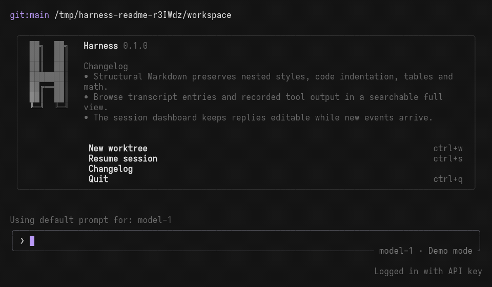

<div align="center">
  <h1>agent-harness</h1>
  <p>A coding agent for your terminal, with tool permissions and replayable sessions.</p>
  <p>
    <a href="#get-started">Get started</a> ·
    <a href="#connect-a-provider">Connect a provider</a> ·
    <a href="docs/README.md">Documentation</a> ·
    <a href="docs/README.fi.md">Suomeksi</a>
  </p>
</div>

<p align="center">
  <picture>
    <source media="(prefers-reduced-motion: reduce)" srcset="docs/assets/harness-tui.png" />
    
  </picture>
</p>

<p align="center">
  Recorded from the real TUI with the offline mock provider.<br />
  <a href="docs/assets/harness-tui.png">Still image</a> · <a href="docs/assets/README.md">Record the demo</a>
</p>

Harness runs coding agents in a Rust CLI and Ratatui terminal UI. Agents can read
and edit files, run commands, call configured MCP tools, and delegate work to
named subagents. One coordinator checks permissions and owns execution.

Sessions keep an append-only event log. You can inspect or replay a session
without repeating its tool calls or contacting a provider.

## Get started

Build with Git and the stable Rust toolchain selected by
[`rust-toolchain.toml`](rust-toolchain.toml):

```bash
git clone https://github.com/urbanbreach/agent-harness.git
cd agent-harness
cargo build -p harness --locked

# Try the terminal UI without credentials or network access.
./target/debug/harness tui --mock
```

Type `hello` and press Enter to receive the scripted reply. Press `Ctrl+p` for
the command palette. The mock provider accepts fixture prompts, so use a live
provider for your own coding tasks.

To use `harness` outside this checkout, install the binary:

```bash
cargo install --path crates/harness --locked
```

## Connect a provider

Copy [`configs/harness.example.jsonc`](configs/harness.example.jsonc) to
`harness.jsonc` in the project you want to work on. The starter selects
`openai-codex/gpt-5.4-mini`. Run these commands from that project:

```bash
harness config validate
harness doctor
harness auth login codex
harness
```

The starter uses Codex OAuth, with `OPENAI_API_KEY` as a fallback. Keep credentials
out of the config file. `doctor` checks local configuration and credential
availability. A live turn checks whether the account and endpoint work.

Harness implements OpenAI-compatible and Anthropic transports. See
[provider support](docs/configuration/provider-support.md) for credentials, model
selection, fallback behavior, and limits.

## Work with Harness

| Task | Command or control |
| --- | --- |
| Open the interactive agent | `harness` |
| Run a prompt without the TUI | `harness run "Summarize this workspace"` |
| Open commands and settings | `Ctrl+p` in the TUI |
| List saved sessions | `harness sessions list` |
| Inspect a session | `harness sessions inspect <run-id-or-path>` |
| View session branches | `harness sessions tree <run-id-or-path>` |
| Find the source of a setting | `harness config explain model` |

The parent agent can delegate through `task`. The named subagents are `explore`,
`general`, and `librarian`. Each has its own tools and role permissions, subject
to shared project policy. See [agents and tasks](docs/operations/generic-agent-and-tasks.md).

## Set permissions

The starter allows ordinary tools. It still asks about external directories,
repeated identical calls, and sensitive file reads. Permissions control tool
execution; they do not confine an approved shell command to an OS sandbox.

For example, replace the starter's `permission` value with this block to ask
before edits and allow only selected shell commands:

```jsonc
"permission": {
  "edit": "ask",
  "bash": {
    "*": "deny",
    "git status*": "allow",
    "cargo nextest run*": "ask"
  },
  "webfetch": "deny"
}
```

The last matching rule wins. Put broad rules first and exceptions afterward.
Read the [permission guide](docs/permissions/permissions.md) before changing
shared or subagent policy.

Runtime settings belong in `harness.jsonc`; keyboard settings belong in
`tui.jsonc`. Use `harness config sources` to see the load order and
`harness config show --effective` to inspect the merged, redacted configuration.
The [config reference](docs/configuration/config.md) lists the supported keys.

## Inspect and share a session

```bash
harness sessions inspect <run-id-or-path>
harness sessions export --session-dir <session-dir> --output support-bundle.json <run-id-or-directory-name>
```

Support exports contain replay-derived metadata and redaction results. The export
stops without writing a bundle if its secret scan fails. See
[sessions and replay](docs/architecture/sessions-and-replay.md) and
[local data](docs/permissions/privacy-and-local-data.md) before sharing logs.

## Contribute

The workspace has six crates. Start with the [architecture guide](docs/architecture/architecture.md)
for code ownership and the [terminal design guide](DESIGN.md) for UI changes.

```bash
cargo fmt --all -- --check
scripts/test-lanes.sh fast
scripts/test-lanes.sh quality-gates
```

Use nextest for Rust tests. The [testing guide](docs/testing/testing.md) explains
the integration, simulation, performance, PTY, and live-provider lanes.
For setup failures, start with [troubleshooting](docs/operations/troubleshooting.md).
