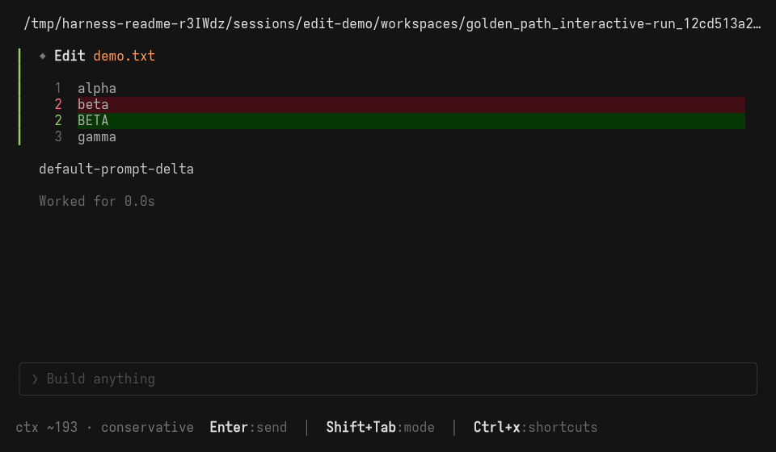

<div align="center">
  <h1>agent-harness</h1>
  <p><strong>An event-sourced, terminal-native harness for agents that need to act, delegate, and leave a replayable trail.</strong></p>
  <p>
    <code>Rust</code> · <code>Ratatui</code> · <code>multi-provider</code> · <code>local-first</code>
  </p>
  <p>
    <a href="#get-started">Get started</a> ·
    <a href="#configure-the-harness">Configure</a> ·
    <a href="#operate-with-confidence">Operate</a> ·
    <a href="docs/configuration/config.md">Reference</a>
  </p>
</div>

<p align="center">
  
</p>

<p align="center"><em>Local offline TUI preview. Run <code>harness</code> with no subcommand to open the interactive shell.</em></p>

Harness is a CLI and terminal UI for running coding agents with one coordinator as the authority for scheduling, permissions, tool execution, session history, and recovery. It is designed for people who want an agent to be capable without becoming opaque: every run is recorded as append-only events, and replay reads those events without re-running tools, hooks, providers, or network calls.

| You need | Harness gives you |
| --- | --- |
| A dependable interactive agent | A compose-first Ratatui shell, model switching, permission prompts, and session navigation. |
| Scriptable automation | `run` for headless prompts, `prompt` for the focused compatibility surface, and deterministic mock runs for offline checks. |
| Controlled delegation | Generic child `task` calls with coordinator-owned permissions, lineage, and background-task controls. |
| Debuggable history | Redacted event logs, side-effect-free replay and inspection, lineage, and support exports. |
| A configuration you can reason about | JSONC runtime and TUI settings, layered discovery, source attribution, and a secret-safe doctor. |

## Get started

### 1. Build from source

You need the pinned Rust toolchain and `git`. Clone the workspace, build the CLI, then create a clean first-run directory with the shipped starter config:

```bash
git clone <repo-url> agent-harness
cd agent-harness
cargo build -p harness

export HARNESS_BIN="$PWD/target/debug/harness"
mkdir -p /tmp/harness-first-run
cp configs/harness.example.jsonc /tmp/harness-first-run/harness.jsonc
cd /tmp/harness-first-run
```

### 2. Validate before connecting a provider

The starter is configured for the built-in `openai-codex` provider. First prove the local setup is coherent:

```bash
"$HARNESS_BIN" --version
"$HARNESS_BIN" config validate
"$HARNESS_BIN" doctor
```

`doctor` checks local readiness—config, provider and model metadata, credential availability, tools, prompts, permissions, session storage, and configured MCP registration. It never makes a provider or MCP network request, so a green doctor is not a live-authentication proof.

### 3. Exercise the full path offline

Run a deterministic mocked turn before spending a token:

```bash
"$HARNESS_BIN" run --mock "Hello from Harness" \
  --out prompt.events.jsonl --print-run-dir
```

This checks the first-prompt path and writes an event log. It is intentionally separate from credential and transport checks.

### 4. Connect and start a real session

Keep credentials out of `harness.jsonc`. The starter uses Codex OAuth and supports an `OPENAI_API_KEY` fallback. Authenticate, then launch the terminal UI:

```bash
"$HARNESS_BIN" auth login codex
"$HARNESS_BIN"
```

For a one-shot headless prompt instead, use:

```bash
"$HARNESS_BIN" run "Summarize the current workspace"
```

Use one live `run` or interactive turn to prove provider authentication and transport. If that fails, start with [`doctor`](docs/operations/troubleshooting.md) and the [provider support guide](docs/configuration/provider-support.md).

## Configure the harness

Harness separates runtime configuration from TUI preferences:

| File | Owns | Start from |
| --- | --- | --- |
| `harness.jsonc` | Providers, models, agents, permissions, formatters, skills, and MCP servers | [`configs/harness.example.jsonc`](configs/harness.example.jsonc) |
| `tui.jsonc` | Keybindings only | [`configs/tui.example.jsonc`](configs/tui.example.jsonc) |

Copy the starter, then tune the few decisions that actually shape day-to-day behavior:

```jsonc
{
  // Default provider/model for sessions started here.
  "model": "openai-codex/gpt-5.4-mini",

  // One generic parent plus bounded named subagents.
  "agent": { "default": { "variant": "high" } },

  // Make sensitive work explicit. The last matching bash rule wins.
  "permission": {
    "edit": "ask",
    "bash": {
      "git *": "allow",
      "cargo test*": "ask",
      "*": "deny"
    },
    "webfetch": "deny"
  }
}
```

The snippet shows edits to a copied starter, not a standalone config. The starter supplies the provider catalog and generic agent defaults that those settings extend.

### What to configure first

| Setting | Why it matters |
| --- | --- |
| `provider` and `model` | Defines the available provider/model catalog and the active default. |
| `model_profile` | Names reusable model and reasoning-variant targets. |
| `agent` | Tunes the generic `default` parent and named subagents such as `explore` and `librarian`. |
| `permission` | Decides whether built-in tool capabilities are allowed, asked, or denied. |
| `formatter` | Controls post-edit formatters; omit it to keep the built-in formatter registry enabled. |
| `mcp` | Registers enabled, config-backed MCP servers into the runtime tool registry. |

The [full config reference](docs/configuration/config.md) documents every public key and its validation behavior. For the exact permission vocabulary and ruleset semantics, read the [permissions guide](docs/permissions/permissions.md).

### Understand where a setting came from

Runtime config layers merge from shared defaults to project-local settings. The canonical locations are XDG global config, project `harness.json{,c}`, and `.agent-harness/harness.json{,c}` discovered toward the project root; explicit environment overlays can take final precedence. The shipped generic prompt lives at `.agent-harness/agents/default.md`.

Do not guess which file won. Ask the CLI:

```bash
"$HARNESS_BIN" config show --effective
"$HARNESS_BIN" config sources
"$HARNESS_BIN" config explain model
"$HARNESS_BIN" config settings
```

The effective view redacts secret-bearing values. `sources` shows merge order, `explain` attributes one dotted key to its winning layer, and `settings` lists typed metadata without secret values.

### Tune the terminal UI separately

Put keyboard preferences in `tui.jsonc`; they never share the runtime config surface:

```jsonc
{
  "keybinds": {
    "leader": "ctrl+x",
    "palette": "ctrl+p, <leader>p",
    "switch_model": "<leader>m",
    "open_lineage_browser": "<leader>g"
  }
}
```

See the [TUI configuration reference](docs/configuration/config.md#tui-top-level-keys) for all action ids and default bindings.

## Operate with confidence

### Pick the right surface

| Goal | Use |
| --- | --- |
| Work interactively | `harness` starts the generic coding agent. |
| Think before changing files | Ask the generic agent for analysis or a written plan before implementation. |
| Run in CI or a script | `harness run "<prompt>"` |
| Exercise a focused lower-level prompt path | `harness prompt --text "<prompt>" --out events.jsonl` |
| Delegate bounded work | Have an agent call the canonical `task` tool with an explicit prompt, background choice, and optional skill list. |

The [generic agent and tasks guide](docs/operations/generic-agent-and-tasks.md) explains the parent prompt, named subagents, delegation-body shape, and runtime boundaries that prevent worker redelegation bypasses.

### Keep sessions inspectable

Harness treats events as the source of truth. Session tools and the CLI inspect replay-derived data only; they do not resume a provider, invoke tools, launch MCP servers, or make network calls.

```bash
"$HARNESS_BIN" sessions list
"$HARNESS_BIN" sessions inspect <run-id-or-path>
"$HARNESS_BIN" sessions export \
  --session-dir <session-dir> \
  --output support-bundle.json \
  <run-id-or-directory-name>
```

Use a support export rather than sharing raw events. It contains replay-derived metadata, a redaction manifest, non-secret configuration summaries, and a secret-scan result. Learn more in [sessions and replay](docs/architecture/sessions-and-replay.md) and [privacy and local data](docs/permissions/privacy-and-local-data.md).

For command discovery and automation, these canonical paths are stable:

```bash
harness config validate
harness config show --effective
harness config sources
harness config explain model
harness config settings
harness doctor
harness prompt --text "Summarize the workspace" --out events.jsonl
harness sessions inspect <session>
harness sessions export --session-dir <dir> --output support.json <session>
harness sessions tree <session>
harness sessions fork <session>
harness sessions clone <session>
```

### Know the safety boundary

The coordinator resolves permissions before a native tool runs. The canonical public permission names are `bash`, `edit`, `question`, `task`, `webfetch`, `websearch`, `codesearch`, and `lsp`. Tool output is captured as part of the event history, while provider metadata and support artifacts are redacted.

For capabilities and replay behavior tool by tool, see the [native tool catalog](docs/tools/native-tool-catalog.md). For important limits—such as why replay never executes a tool—see the [architecture](docs/architecture/architecture.md).

## Develop and verify

The repository has fast deterministic checks for everyday work and explicit signoff lanes for PTY, live-provider, and native-visual evidence:

```bash
scripts/test-lanes.sh fast
scripts/test-lanes.sh quality-gates
scripts/test-lanes.sh integration
scripts/test-lanes.sh all-deterministic
```

For product-touching runtime, CLI, tool, scenario, or session-path changes, also run the offline mock dogfood path:

```bash
bash scripts/harness-qa-dogfood.sh --self-test
```

The [testing and signoff map](docs/testing/testing.md) explains exactly what each lane proves—and, just as importantly, what it does not prove.

## Troubleshooting shortcuts

| Symptom | First move |
| --- | --- |
| A config change appears ignored | Run `config sources` and `config explain <path>`. |
| `doctor` passes but prompts fail | Run one live prompt; doctor deliberately does not test authentication or transport. |
| A tool is denied | Review the resolved `permission` policy and the tool’s public permission bucket. |
| A session will not resume | Inspect it read-only with `sessions inspect`, then export a redacted support bundle. |
| A terminal surface looks wrong | Retry with `--mock`, open the command palette with `Ctrl+p`, and record terminal details with the support export. |

The [first-run troubleshooting guide](docs/operations/troubleshooting.md) contains the longer diagnosis paths.

## Explore the project

| Area | Start here |
| --- | --- |
| Configuration and providers | [Config reference](docs/configuration/config.md) · [Provider support](docs/configuration/provider-support.md) |
| Tools and permissions | [Native tool catalog](docs/tools/native-tool-catalog.md) · [Permissions](docs/permissions/permissions.md) |
| Sessions and recovery | [Sessions and replay](docs/architecture/sessions-and-replay.md) · [Privacy](docs/permissions/privacy-and-local-data.md) |
| Architecture | [Crate boundaries and invariants](docs/architecture/architecture.md) |
| Testing | [Testing and signoff](docs/testing/testing.md) |
