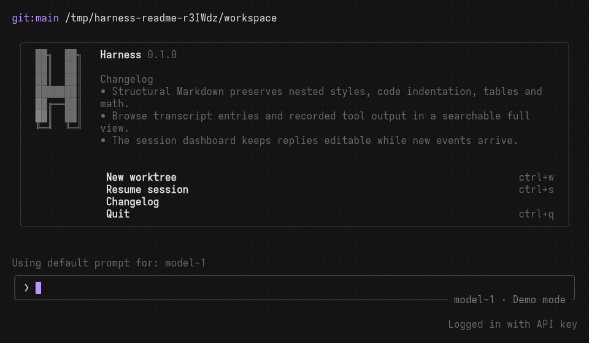

<div align="center">
  <h1>agent-harness</h1>
  <p>A coding agent for your terminal, with tool permissions and replayable sessions.</p>
  <p>
    <a href="#get-started">Get started</a> ·
    <a href="#connect-a-provider">Connect a provider</a> ·
    <a href="docs/README.md">Documentation</a> ·
    <a href="docs/README.fi.md">Suomeksi</a>
  </p>
</div>

<p align="center">
  <picture>
    <source media="(prefers-reduced-motion: reduce)" srcset="docs/assets/harness-tui.png" />
    
  </picture>
</p>

<p align="center">
  Recorded from the real TUI with the offline mock provider.<br />
  <a href="docs/assets/harness-tui.png">Still image</a> · <a href="docs/assets/README.md">Record the demo</a>
</p>

Harness runs coding agents in a Rust CLI and Ratatui terminal UI. Agents can read
and edit files, run commands, call configured MCP tools, and delegate work to
named subagents. One coordinator checks permissions and owns execution.

Sessions keep an append-only event log. You can inspect or replay a session
without repeating its tool calls or contacting a provider.

## Get started

Harness supports Linux only, on x86_64 and aarch64. macOS and Windows are not
supported or tested.

Install the latest release:

```bash
curl -fsSL https://github.com/urbanbreach/agent-harness/releases/latest/download/install.sh | sh
cd /path/to/your/project
harness
```

The script downloads the static binary for your CPU, checks it against the
release's `SHA256SUMS`, and installs it to `~/.local/bin`. Set
`HARNESS_VERSION=v0.1.0` to pick a release or `HARNESS_INSTALL_DIR` to install
somewhere else. To uninstall, delete the `harness` file. Release archives are
also on the [releases page](https://github.com/urbanbreach/agent-harness/releases).

No config file is needed. On a new project with no connected provider or saved
sessions, Harness opens the login picker automatically. Choose a provider and
sign in, then type a coding task and press Enter. Esc closes the picker; use
`/login` to reopen it. Returning users without a connection see
`No provider connected. Use /login.` instead.

For an offline UI demo, run `harness tui --mock`, type `hello`, and press Enter.
The mock provider replies to fixture prompts only. `Ctrl+p` opens the command
palette.

JavaScript `eval` requires [Node.js 24 or newer](https://nodejs.org/en/download)
on `PATH`. Install the current Node.js LTS release and check `node --version`.
Harness includes its eval scripts and parser; no npm install is needed to use
eval. Python eval also needs `python3` or `python`.

### Build from source

Build with Git and the stable Rust toolchain selected by
[`rust-toolchain.toml`](rust-toolchain.toml). The default build needs no other
linker or tools:

```bash
git clone https://github.com/urbanbreach/agent-harness.git
cd agent-harness
cargo install --path crates/harness --locked
```

Use release builds for interactive sessions. Unoptimized development builds
spend substantially more CPU rendering active tools and streaming text.
Linking with Wild is faster and opt-in; see the
[build settings](docs/testing/build-performance.md). Maintainers cut releases
with `scripts/release.sh`; see [releasing](docs/operations/releasing.md).

## Connect a provider

In the TUI, `/login` opens the provider picker. It includes OpenAI ChatGPT
Plus/Pro sign-in or an API key, GitHub Copilot device login, Anthropic API key,
Claude Pro/Max subscription, Google, OpenRouter, and more.

You can also connect from the command line:

```bash
harness auth login codex
# Or choose another provider with: harness auth login <provider>
harness doctor
harness
```

An exported API key works without a login command or config file:

```bash
export ANTHROPIC_API_KEY="your-api-key"
harness
```

Harness discovers stored credentials and provider API key environment variables
from its embedded models.dev catalog. Keep credentials out of config files.
`harness doctor` is an offline readiness check; a live turn checks account and
endpoint access. See [provider support](docs/configuration/provider-support.md)
for details.

Config is optional. After the first successful sign-in, Harness creates
`~/.harness/harness.jsonc` with the default model for that provider, if one is
known. It never overwrites an existing user config and skips the write when
`HARNESS_CONFIG` or `HARNESS_CONFIG_CONTENT` is set. Use this file for personal
defaults and `<project>/harness.jsonc` for project policy. The project layer
overrides personal defaults. `HARNESS_HOME` changes the personal config directory.
[`configs/harness.example.jsonc`](configs/harness.example.jsonc) is a short
annotated starter, not a model catalog or a required setup step.

A config with no provider entries keeps automatic discovery. Defining any
`provider` entry makes the catalog curated: only configured providers plus
signed-in Codex, GitHub Copilot, and Claude subscription are included.

## Work with Harness

| Task | Command or control |
| --- | --- |
| Open the interactive agent | `harness` |
| Run a prompt without the TUI | `harness run "Summarize this workspace"` |
| Open commands and settings | `Ctrl+p` in the TUI |
| List saved sessions | `harness sessions list` |
| Inspect a session | `harness sessions inspect <run-id-or-path>` |
| View session branches | `harness sessions tree --root <run-id-or-path>` |
| Find the source of a setting | `harness config explain model` |

The parent agent delegates through `spawn_subagent`. Built-ins are `task`,
`scout`, `reviewer`, `security-reviewer` and `sonic`. Add Markdown definitions
with YAML frontmatter under `<project>/.harness/agents/` or `<home>/agents/`.
The nearest project definition wins over user files, which win over built-ins.
`task` inherits the parent model; scout and sonic use `@smol`, while both
reviewers use `@slow`. Configure these optional roles in `model_roles`; an unset
role inherits the parent model. All tools remain subject to shared project policy.
See [agents and tasks](docs/operations/generic-agent-and-tasks.md).

Custom slash prompt commands are Markdown files in `<project>/.harness/commands/`
or `<home>/commands/`. Use them in the TUI or with `harness run "/name args"`
and `harness prompt`. The bundled `/init` asks the agent to create or update a
concise root `AGENTS.md` while preserving user content. See
[command templates](docs/operations/extension-strategy.md#markdown-prompt-commands).

## Set permissions

Built-in permissions allow ordinary tools but ask about external directories,
repeated identical calls, and sensitive file reads. Permissions control tool
execution; they do not confine an approved shell command to an OS sandbox.

To ask before edits and allow only selected shell commands, add this block to
an optional personal or project config:

```jsonc
"permission": {
  "edit": "ask",
  "bash": {
    "*": "deny",
    "git status*": "allow",
    "cargo nextest run*": "ask"
  },
  "webfetch": "deny"
}
```

The last matching rule wins. Put broad rules first and exceptions afterward.
Read the [permission guide](docs/permissions/permissions.md) before changing
shared or subagent policy.

Runtime settings belong in `harness.jsonc`; keyboard settings belong in
`tui.jsonc`. Use `harness config sources` to see the load order and
`harness config show --effective` to inspect the merged, redacted configuration.
The [config reference](docs/configuration/config.md) lists the supported keys.

## Where Harness stores data

User files live in `~/.harness/`. A nonempty `HARNESS_HOME` replaces this root
as-is; Harness does not append another directory to it. Under that root:

- `harness.jsonc` or `harness.json`: personal runtime config, first existing wins.
- `tui.jsonc` or `tui.json`: personal keyboard config, first existing wins.
- `credentials/`, `anthropic-subscription-bindings/`, `models-cache.json`: saved
  sign-ins, subscription bindings and cached model metadata.
- `prompts/`, `agents/`, `commands/`, `skills/`: personal prompt templates,
  agent definitions, slash commands and skills.
- `model.json`: the last model picked in the TUI;
  `HARNESS_MODEL_SELECTION_STATE_FILE` can override its path.
- `sessions/<key>/`: sessions and their artifacts.
- `projects/<key>/`: workspace memory, code index, edit attribution and plans.
- `worktrees/<key>/`: managed Git worktrees.

Skills also load from `$HOME/.agents/skills` by default. Set `skills.global_roots`
to change the roots. Project keys encode the project path: for `/home/me/code/app`,
sessions live in `sessions/--home-me-code-app--/`.

The project's `.harness/` holds authored agents, commands, skills and prompt
overrides, project config and remembered permission approvals. Project skills
also load from `.agents/skills`, below Harness skill roots.

Earlier builds saved sessions in `<project>/.agent-harness/sessions`. They are
not migrated; open them with `--session-dir`:

```bash
harness sessions list --session-dir .agent-harness/sessions
```

## Inspect and share a session

```bash
harness sessions inspect <run-id-or-path>
harness sessions export --session-dir <session-dir> --output support-bundle.json <run-id-or-directory-name>
```

Support exports contain replay-derived metadata and redaction results. The export
stops without writing a bundle if its secret scan fails. See
[sessions and replay](docs/architecture/sessions-and-replay.md) and
[local data](docs/permissions/privacy-and-local-data.md) before sharing logs.

## Contribute

The workspace uses Rust 2024 across seven crates and builds with the stable toolchain. Start with the [architecture guide](docs/architecture/architecture.md)
for code ownership and the [terminal design guide](DESIGN.md) for UI changes.

```bash
cargo fmt --all -- --check
scripts/test-lanes.sh fast
scripts/test-lanes.sh quality-gates
```

Use nextest for Rust tests. The [testing guide](docs/testing/testing.md) explains
the integration, simulation, performance, PTY, and live-provider lanes.
For setup failures, start with [troubleshooting](docs/operations/troubleshooting.md).

## License

Harness is released under the [MIT License](LICENSE).
