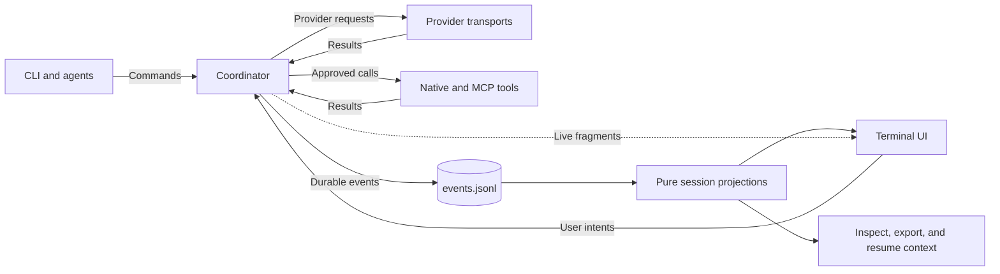

# Architecture

The coordinator owns execution. CLI commands, agents, and the TUI submit intents;
the coordinator schedules work, checks permissions, and appends durable events.
Replay derives session state from those events without running tools or providers.



Solid arrows show commands, results, and durable reads. The dotted arrow carries
live display updates that do not enter the event log.

## Crate boundaries

### CLI

[`harness`](../../crates/harness/src/lib.rs) parses CLI arguments and dispatches commands:

| Command | Responsibility |
| --- | --- |
| `harness run` | Execute a headless prompt or deterministic scenario |
| `harness tui` | Open the terminal UI |
| `harness sessions inspect` / `export` | Inspect recorded events or produce a support bundle |
| `harness schema` | Print JSON Schema |
| `harness config validate` | Validate configuration |
| `harness sessions list` | List recorded sessions |

### Core runtime

[`harness-core`](../../crates/harness-core/src/lib.rs) contains runtime state and policy:

| Module | Responsibility |
| --- | --- |
| `event` | Versioned events, envelopes, and event builders |
| `store` | In-memory and JSONL event stores |
| `coord` | Coordinator actor and execution authority |
| `sched` | Concurrency slots and stale-task detection |
| `cron_schedule` | Schedule registration and executor availability metadata |
| `perm` | Allow, deny, and ask decisions |
| `tool` | Tool contracts and capability checks |
| `edit` | Hashline editing |
| `proj` | Pure run summaries, resume plans, and session catalog projections |
| `transcript_projection` | Replay-derived sessions, messages, and message parts |
| `agent` | Provider-facing execution state for parent and child agents |
| `config` | Config parsing and validation |
| `clock` | Real and deterministic clocks |
| `redact` | Secret redaction before persistence |

The cron registry reports `registered` separately from `executor_available`.
Registration does not start a schedule. `executor_available=false` until a
product executor loop is connected.

### Session read boundary

Each journal load or settled batch of durable events builds one
`CanonicalSessionProjection`. It combines pure reducers for session state,
conversation, transcript, resume plan, run summary, timeline, tasks, permissions,
and lineage. Each reducer keeps its own validation and error behavior.

Provider continuation, restart, replay, export, catalog inspection, and settled
TUI views read that projection. The TUI adds temporary display fragments and
formatting; it does not reconstruct a separate durable session.

The bounded history index is advisory metadata updated after a successful durable commit. List and
search validate its fingerprinted rows, rebuild unusable state, and still validate source journals
for inspect, replay, export, reopen, and continuation. Compatibility-only old event shapes remain
inside the read-only `session::legacy` boundary; active production code neither appends them nor
uses them as durable truth.

### Agent prompt assets and instructions

Interactive agent runtime settings come from structured config, while the prompt body is resolved separately from the shipped asset and project instructions:

- `.agent-harness/agents/default.md` supplies the generic coding prompt.
- Inline `agent.<name>.system_prompt` replaces that agent's shipped body.
- `AGENTS.md` is loaded as a separate project-instruction layer and composed into the final runtime system prompt.

This keeps config focused on structured behavior while allowing one prompt to adapt to model, workspace, project-instruction, and skill context.

### Prompt implementation map

The prompt implementation maps each behavior to these files and runtime checks:

| Behavior | Implementation | Status |
|---|---|---|
| Generic coding prompt | `.agent-harness/agents/default.md`, `crates/harness/src/bootstrap.rs`, and `crates/harness/src/dynamic_prompt.rs` | Used by interactive execution without primary-role switching |
| Intent-gate before tool use | `crates/harness/src/dynamic_prompt.rs` (`intent_gate`) | Shipped for ambiguous requests before tool use |
| Named subagents | `.agent-harness/agents/{explore,general,librarian}.md` and the `task(subagent_type=...)` contract | Preserved as bounded child profiles |
| Structured delegation reminder | `crates/harness/src/dynamic_prompt.rs` (`delegation_reminder`), `docs/operations/generic-agent-and-tasks.md`, and the `task` native tool contract | Shipped as named subagent guidance |
| Category-specific routing and prompt appends | `harness_core::agent_catalog` and named profile configuration | Shipped as bounded named profiles, not a category router |
| Markdown-defined skills with progressive disclosure | `harness-tools::skill_catalog`, `.agent-harness/skills/*/SKILL.md`, and `docs/configuration/starter-skills.md` | Shipped for the V1 built-in skill set |
| Disableable built-in capabilities | `skills.disabled` config shape, `SkillCatalogStatus::Disabled`, doctor skill catalog metadata, `harness-core::extension_manifest`, `configs/extension-manifest.v1.schema.json`, and `docs/operations/extension-strategy.md` | Skills ship as runtime capabilities; typed extension manifests ship as descriptor-only metadata with runtime hosting post-V1 |
| Command/hook lifecycle maps | `docs/operations/extension-strategy.md` command/hook seam | Native lifecycle hooks ship; markdown command files and extension command-hook execution remain unsupported/post-V1 |

### Providers

[`harness-providers`](../../crates/harness-providers/src/lib.rs) normalizes backend streams:

- `Provider` defines streaming completions.
- `MockProvider` matches requests to deterministic offline fixtures by digest.
- `OpenAiCompatibleProvider` streams HTTP/SSE responses from compatible endpoints.
- The Anthropic backend normalizes its messages into the same provider event types.

### Tools

[`harness-tools`](../../crates/harness-tools/src/lib.rs) registers and executes native tools:

- `read` / `list` / `glob` / `grep` - Safe workspace discovery and search
- `edit` - Hashline-first file creation, targeted edits, deletion, and rename
- `bash` - Execute shell commands with allowlist
- `task` / `background_output` / `batch` / `question` / `skill` - Control-plane and delegation workflows
- `background_cancel` - Explicit coordinator-owned cancellation wrapper for background child requests
- `session_list` / `session_read` / `session_search` / `session_info` - Replay-derived model-visible session inspection tools
- `ast_grep_search` - Read-only ast-grep CLI structural search adapter with workspace path safety, hard caps, and artifact spill
- `ast_grep_replace` - Edit-permission structural rewrite adapter that defaults to dry-run, uses ast-grep JSON rewrite output only, and applies through Harness path checks, atomic writes, and diff artifacts
- `webfetch` / `websearch` / `codesearch` / `lsp` - Network and language-intelligence workflows

Agents can change files through `edit`, `write`, `apply_patch`, and other
edit-permission tools in their toolset. Low-level hashline scan/apply helpers
remain internal compatibility and test APIs.

The registry exposes canonical IDs such as `read`, `edit`, `bash`, and `task`.
Executors stay behind those IDs. See the [tool catalog](../tools/native-tool-catalog.md)
for permissions and output behavior.

`harness-tools::tool_catalog` mirrors the active registry as metadata: stable
canonical id, provider function name, aliases, description summary, capability,
permission kind, actor availability, supervisor-only status, schema status,
mutation/read-only classification, replay behavior, artifact behavior, and docs
status. Doctor and support export can read this metadata without starting MCP
servers or making network calls.

`ast_grep_replace` is present only as an edit-permission native tool. The
ast-grep process supplies JSON rewrite ranges but never mutates the workspace
directly; Harness validates byte ranges against current file contents, rejects
overlap/truncated apply, writes diff artifacts, and performs atomic workspace
writes through the same edit authority boundary.

### Terminal UI

[`harness-tui`](../../crates/harness-tui/src/lib.rs) renders the Ratatui interface:

It subscribes to coordinator events in live mode and reads recorded sessions in
replay mode. Permission dialogs collect decisions, diff views display file
changes, and the transcript groups related tool and provider output.

### Test support

[`harness-testkit`](../../crates/harness-testkit/src/lib.rs) supplies test fixtures:

It provides mock provider fixtures, deterministic run helpers, and PTY checks
using `portable-pty` and `vt100`.

## Event schema v1

Durable events define replayable session state. Live fragments and UI overlays
remain temporary.

### Envelope structure

```json
{
  "schema_version": 1,
  "event_id": "uuid",
  "seq": 42,
  "run_id": "uuid",
  "mono_ms": 12345,
  "ts": "2024-01-15T10:30:00Z",
  "actor": {"kind": "Supervisor", "agent_id": null},
  "correlation_id": "tool-call-uuid",
  "causation_id": "prev-event-uuid",
  "stream_key": "agent-1",
  "payload": {"RunStarted": {...}}
}
```

### Durable and live event boundaries

A new assistant completion is self-contained in its durable `AssistantMessageFinished` event. The
completion carries final sanitized reasoning, text, completed tool intents, provider provenance,
and optional assistant message metadata. Durable replay does not need provider fragments to rebuild
that completion.

Provider fragments are bounded, lossy, non-replayable runtime events. Text, reasoning, and partial
tool input fragments use a 1024-item broadcast channel for connected runtime subscribers. A slow
subscriber can lag and lose fragments. These fragments are never appended to `events.jsonl`, and
replay returns only durable events.

The legacy `EventV1` variants `ProviderStreamDelta` and `ProviderReasoningDelta` remain decode-only
on the provider execution path. They are retained so old logs, including interrupted logs with
partial assistant output, remain readable. New provider execution publishes corresponding
fragments only as live events and doesn't append these variants.

### Event types

Lifecycle
- `RunStarted` / `RunFinished` / `RunFailed`
- `SessionTitleUpdated` - Harness-compatible generated session title persisted after the first real user prompt when a default title is still present
- `AgentSpawned` / `AgentStopped`

Task management
- `TaskScheduled` - Includes `task_id`, `state` (queued or started), optional `queue_key`, and optional typed `metadata`; child agent turns record parent-tool/child-request lineage in `metadata.lineage` when scheduled so active lifecycle projections do not depend on terminal events
- `TaskCancelled` - Best-effort cancellation, or execution failure when `failure` is true
- `TaskCompleted` - Normal completion
- `TaskResultLate` - Result arrived after cancellation
- `BackgroundTaskNotification` - Durable parent wakeup record for a `task(run_in_background=true)` child request after the child reaches a terminal state; carries parent/child ids, terminal status (`completed`, `cancelled`, `failed`, or `timed_out`), capped summary, terminal event id, and delivered parent turn request id. Replay projects this event only and must not schedule provider work.

Progress and staleness
- `StaleDetected` - Task exceeded staleness timeout
- `UserMessageSubmitted` - User prompt accepted into the event stream
- `PromptAttachmentsSubmitted` - Prompt attachment metadata accepted into the event stream

Background child-task completion wakeups are coordinator-owned. The child terminal
`TaskCompleted` / `TaskCancelled` event is written first, then the coordinator appends one
`BackgroundTaskNotification` per background child request and queues a parent
system-reminder turn through the same agent scheduling path used for normal turns. Sync child
tasks do not emit this notification because their result is returned directly through the `task`
tool response. Notification summaries are capped; full child history remains available through
`background_output` and the event/artifact log. `background_output` resolves lineage, status,
cancellation targets, and late-result markers through coordinator-owned replay projection rather
than a tool-local background manager or in-memory task handle, so the same child request remains
observable after coordinator resume.
Replay and TUI surfaces render child-session next actions from the same projected ids: terminal
children point at `background_output(request_id=...)` for full details and `task(session_id=...)`
for deliberate continuation, while non-terminal children also show non-blocking/blocking status
checks without scheduling work during replay.

Provider Streaming
- `ProviderRequestStarted`
- `ProviderStreamDelta` - Legacy decode-only text fragment from old logs
- `ProviderReasoningDelta` - Legacy decode-only reasoning fragment from old logs
- `ProviderRequestFinished`
- `AssistantMessageFinished` - Self-contained assistant commit before tool preflight/execution; includes `request_id`, `tool_call_count`, `parts`, `provenance`, and optional `assistant_message`
- Provider tool-call deltas/completions are normalized before coordinator execution
- `SessionCompaction` (`agent_id`, `summary`, `first_kept_event_seq`, `first_kept_request_id`, `first_kept_entry_id`, `tokens_before`, `tokens_after`, `summary_usage`, `summary_provider_id`, `summary_model_id`, `read_files`, `modified_files`, `task_intent`, `current_intent`, `trigger_reason`, `from_hook`) - session-level compaction event; replaces the deprecated compaction sequence.
- Deprecated read-only compatibility variants: `CompactionRequested`, `CompactionWritten`, `CompactionApplied`, `CompactionFailed`.
- `BranchSummary` - branch-level summary event for forked/child session context.

### Provider lifecycle metadata contract

The durable provider lifecycle barriers are `ProviderRequestStarted` and `ProviderRequestFinished`.
Replay, resume, and audits may rely on their ordered presence, shared `request_id`, provider/model
ids, redacted prompt summary, request digest, finish reason, output digest, and aggregate usage.
`AssistantMessageFinished` is the separate durable assistant-message boundary. It is appended after
provider transport finishes and before tool preflight or execution. For new logs, its ordered `parts`
and `provenance` are the authoritative assistant content. Empty defaulted fields preserve decoding
of old logs, whose content can still be reconstructed from legacy delta variants. These barriers
also accept optional metadata objects. Metadata fields are additive, serde-defaulted for old logs,
and ignored for semantic replay decisions except where projections surface them as optional
inspection data.

The following state is not stored as a separate durable semantic barrier:

- connected-client streaming presentation, from bounded live provider fragments,
- tool-call readiness, from the completed tool intents in `AssistantMessageFinished` and later normalized tool events,
- loop continuation, from the finished provider request, executed tool results, and guardrail state,
- provider chunk grouping, which is transport presentation and is absent from new durable history.

Provider metadata is optional and non-semantic for old logs. Missing metadata must not change replay
equivalence. When implementation needs provider metadata, add it to `ProviderRequestStarted` or
`ProviderRequestFinished` as optional redacted fields before adding any new event variant.

Field decisions:

| Metadata | Durable location | Contract |
|----------|------------------|----------|
| Provider call or response id | Optional start/finish `metadata.provider_call_id` or `metadata.provider_response_id` | Store only redacted ids useful for audit correlation. Never treat provider ids as coordinator scheduling keys. |
| Stable turn/request correlation | Existing envelope `correlation_id`, provider `request_id`, and optional `metadata.turn_id` | Durable. Use harness-owned ids for replay and resume. Provider ids are advisory only. |
| Provider session or cache key | Optional start/finish `metadata.provider_session_id` / `metadata.provider_cache_id` | Store redacted summaries or digests only when needed for cache inspection. Missing values are normal. |
| Stop reason | Existing `finish_reason`; optional finish `metadata.provider_stop_reason` | Durable as a summary string. Provider-specific raw finish payloads are omitted. |
| Usage and cache read/write counts | Existing `usage`; optional finish `metadata.cache_read_tokens` / `metadata.cache_write_tokens` | Durable aggregate accounting. Counts are advisory and must be safe to omit from old logs. |
| Assistant completion and audit metadata | Ordered `parts`, `provenance`, and optional `assistant_message` on `AssistantMessageFinished`; compatibility-only mirror in optional finish `metadata.assistant_message` | New logs store the sanitized assistant completion in one self-contained event. Old logs may omit these defaulted fields and use legacy deltas plus the provider-finish metadata mirror. |
| Retry attempt counter and policy | Optional start `metadata.retry` with `{ attempt, max_attempts, delay_ms, category }` | Additive, serde-defaulted counter used for bounded retry before the final provider response is committed. Absent on old logs; the coordinator treats missing retry metadata as the first attempt. |
| Transient error server hint | Optional `retry_after_ms` in Error event metadata (provider-lifecycle finish events) | Records provider Retry-After header values in milliseconds when present. Advisory; scheduling falls back to exponential backoff when absent. Old logs without the field replay identically. |
| Thinking or reasoning signatures | Optional finish `metadata.thinking` | Store only summaries, digests, or signature ids. Never store raw hidden thinking text. |
| Provider payloads and secrets | Never durable | Raw requests, raw responses, auth headers, cookies, keys, and PEM blocks are excluded from event logs. New logs omit provider reasoning deltas. Reasoning metadata stores only summaries, digests, or signature IDs. |

Tool Execution
- `ToolCallRequested`
- `ToolCallStarted`
- `ToolCallFinished`

Permissions
- `PermissionRequested` - User intervention required
- `PermissionGrantRecorded` - Durable allow-always grant recorded for matching future requests in the event log
- `PermissionResolved` - Allow or deny decision recorded

Editing
- `EditProposed` - Edit prepared for review
- `EditApplied` - Edit successfully committed
- `EditRejected` - Edit failed (mismatch, denied, etc.)

Artifacts and Policy
- `ArtifactWritten` - File stored to session
- `PolicyViolationDetected` - Security rule triggered

Workspace Snapshots
- `WorkspaceSnapshot` - Captured working-tree state before a tool batch; stores a redacted map of relative paths to file contents and content digests in the artifact store. Dotenv-style secret files are omitted from snapshot artifacts.
- `WorkspaceReverted` - Restored the workspace from a prior snapshot; records restored paths, removed paths, and any failures without rewriting the event log.

Team Membership
Team membership events record the team role, dependency edges, and shutdown
state for child sessions. Members remain ordinary child agents: their
provider/tool work is represented by the same task and provider lifecycle
events as standalone agents, and event timestamps come from the enclosing
event envelope. `blocks` is a projection-derived inverse of `blocked_by`;
callers provide `blocked_by`, and replay recomputes `blocks`
deterministically. Shutdown approval can stop child sessions or cancel
scheduler tasks; non-lead member sessions stay pending until another active
member is shutdown-approved. Duplicate team membership events are rejected by
the coordinator, and projections keep first-seen state if old logs contain
duplicates.

UI Intent
- `UiIntentReceived` - Live UI intent recorded before coordinator handling

## Coordinator invariants

The Coordinator is the single authority for:

1. Event appending - Only the Coordinator calls `EventStore::append`
2. Task scheduling - All background work goes through Coordinator commands
3. Permission resolution - Coordinator evaluates policies and emits resolution events
4. State transitions - Run and agent lifecycle managed centrally

### Concurrency model

Clients send commands over an `mpsc` channel. The coordinator owns the queue and
scheduler slots, starts admitted work, and broadcasts updates. Only the
coordinator appends durable events to the store.


### Task behavior

- Cancellable tasks: Every background job has a `CancellationToken`
- Late results: If a task reports after cancellation, record `TaskResultLate` and discard side effects
- Slot gates: Coordinator-managed counters avoid semaphore-in-select cancellation unsafety
- Stale watchdog: Periodic checks for unresponsive tasks based on progress heartbeats

## Permission model

Tool capabilities map to public permission names:

| Permission | Tool Capability | Policy Options |
|------------|-----------------|----------------|
| `edit` | `EditFs` | allow / deny / ask |
| `bash` | `Shell` | allow / deny / ask |
| `question` | interactive user question / confirmation flow | allow / deny / ask |
| `webfetch` | `webfetch` | allow / deny / ask |
| `websearch` | `websearch` | allow / deny / ask |
| `codesearch` | `codesearch` | allow / deny / ask |
| `lsp` | Language queries; rename also requires `edit` | allow / deny / ask |
| `task` | Child tasks and background controls | allow / deny / ask |
| `read` | File and skill reads | allow / deny / ask |
| `external_directory` | Access outside the workspace | allow / deny / ask |
| `doom_loop` | Repeated identical tool calls | allow / deny / ask |

Legacy `shell` and `network` names remain migration-only compatibility aliases. User-facing configs
should use the canonical public names above.

### Policy resolution

1. Check global defaults from config
2. Check per-agent overrides
3. Apply decision:
   - `allow` - Proceed immediately
   - `deny` - Emit `PermissionResolved(deny)` and fail
   - `ask` - Check active coordinator-owned durable grants rebuilt from `PermissionGrantRecorded`; if none match, emit `PermissionRequested` and pause until a resolve command

Static configured `deny` is final and is checked before durable grants, so a replayed allow-always grant can satisfy future `ask` decisions but never overrides policy denial. Allow-always decisions record run-scoped grants by default, with explicit scope and optional expiry fields for future extension. Grant matchers persist only redacted-safe selectors: canonical/effective tool id, permission kind, a semantic shell command digest or workspace-relative edit path when available, and request-digest fallback for exact matching.

### Headless mode

In headless scenarios, `ask` defaults to `deny` unless the scenario script explicitly sends `ResolvePermission(Allow)`.

### Worker delegation limits

Workers cannot call direct coordinator spawn APIs. Only `ActorKind::Supervisor` may call `SpawnAgent`. Violations emit `PolicyViolationDetected`.

## Agent turn loop

Agent turns are coordinator-owned state machines. Provider helpers may transform context and stream
one assistant response, but they do not decide task scheduling, append events directly, or execute
tools on the production coordinator path. The turn loop runs through explicit phases:

1. Turn start - the coordinator records the running turn, lifecycle hook state, cancellation
   token, scheduler slot, and stable turn/request correlation id.
2. Context projection and provider transform - provider-visible messages are recomputed at
   provider-start time from the canonical event-derived active path plus the latest committed
   `SessionCompaction` state. Queued turns do not carry stale scheduled-time provider input.
3. Provider stream - the coordinator allocates a fresh provider-call id, invokes the single-call
   provider primitive, and receives provider output through coordinator commands. Text, reasoning,
   and partial tool input are published only as bounded live runtime fragments.
4. Assistant-message barrier - `ProviderRequestFinished` closes provider transport, then
   `AssistantMessageFinished` durably commits the final sanitized reasoning, text, completed tool
   intents, and provider provenance before tool execution. Replay settles from this event even when
   no live fragments were observed.
5. Tool preflight and execution - parsed tool intents are mapped back to canonical tool ids and
   re-enter the coordinator through `ExecuteAgentToolCall`, so permission checks, scheduler slots,
   artifacts, redaction, cancellation, and late-result handling stay on the same path as native tool
   calls.
6. Tool-result projection - completed tool results are appended to the next provider request as
   tool-role messages in assistant source order.
7. Turn end - the agent turn reaches a terminal task lifecycle event, freeing scheduler slots
   for any separately queued turns.

JSONL lifecycle events remain chronological append-time records. A parallel tool batch can therefore
emit `ToolCallFinished` events in completion order while the next provider request receives the
model-visible tool-result messages in the assistant's original source order. Replay and audits should
treat chronological JSONL order as the source of truth for what happened, and the pure conversation
projection as the source of truth for provider model context.

Prompt-mode completion follows the same lifecycle contract: a provider finish is only the assistant
message barrier, while the CLI waits for the correlated agent-turn `TaskCompleted` or `TaskCancelled`
terminal event before reporting completion. The `task` and `batch` tools also preserve coordinator
re-entry: child turns are requested or resumed through coordinator scheduling, never through a direct
agent/provider loop bypass.

Guardrails bound tool-heavy turns by total tool calls per turn, while provider phases continue until
the assistant completes, fails, is cancelled, or hits that explicit tool-call cap. Overflow-style
provider failures may trigger one coordinator compaction retry; the retry recomputes provider context
from the committed compaction event without rewriting `events.jsonl`. Pre-prompt compaction uses the
same pipeline before provider request construction, with deterministic token estimates and a no-loop
guard when a compaction cannot reduce active context.

## Tool availability

Each `agent.<name>.tools` list selects the tools available to that agent. Use canonical IDs such as
`read`, `edit`, `bash`, `task`, and `background_output` directly. Named subagents have bounded prompt
and tool configurations; worker capability filtering, task permission checks, and direct-child ownership
remain coordinator-enforced. By default, `read` emits
`LINE#HASH|text` anchors and `edit` consumes hashline operations on that anchored view.

Model-visible session tools are part of this native surface but remain replay
readers only. They inspect stored session roots, reject traversal/out-of-root
selectors, redact by default, cap inline output, and spill large output to
artifacts. They never call `harness sessions`, execute providers/tools/hooks,
start MCP servers, or make network calls.

`background_cancel` is only a canonical wrapper around the existing coordinator
background cancellation path already used by `background_output(cancel=true)`.
The compatibility form remains supported, but task next-actions prefer
`background_cancel(request_id=...)` for explicit cancellation.

## Hashline edits

Hashline provides atomic, content-addressed file edits.

### Line anchor

```rust
struct LineAnchor {
    line: u32,       // 1-based line number
    hash: String,    // blake3(line_bytes), 12 hex chars
}
```

### Hash computation

1. Split file on `\n`
2. For each line: strip trailing `\r`, hash bytes with blake3
3. Take first 12 hex characters

This normalizes CRLF to LF for hashing while preserving original line endings in output.

### Patch operations

```rust
enum HashlineOp {
    InsertBefore { anchor: LineAnchor, lines: Vec<String> },
    InsertAfter { anchor: LineAnchor, lines: Vec<String> },
    Replace { expected: Vec<LineAnchor>, lines: Vec<String> },
    Delete { expected: Vec<LineAnchor> },
}
```

### Apply algorithm

1. Validate anchors: All anchors must match current content at specified lines
2. Detect overlaps: Operations must not conflict (no two ops touch the same line)
3. Apply bottom-up: Process in descending line order to avoid index drift
4. Atomic write: Write to temp file, then rename

### Error types

- `ANCHOR_MISMATCH` - Line content does not match expected hash
- `OUT_OF_RANGE` - Line number exceeds file bounds
- `OVERLAP` - Multiple operations conflict
- `EMPTY_PATCH` - No operations provided

### Diff artifacts

On successful apply, a unified diff is written to `artifacts/edit-{edit_id}.diff` and referenced in the `EditApplied` event.

## Tool output storage

Tool results are persisted in two layers:

- Event summaries stay capped for JSONL stability.
- Redacted full outputs are written under `artifacts/toolcalls/<tool_call_id>/` and referenced with `ArtifactWritten` events.

Interactive question state for `user.question` is stored separately under
`state/questions/<tool_call_id>.json` inside the run root so headless flows and replay helpers can
inspect the native prompt/answer handoff without scraping tool artifacts.

## Event-store crash-tail recovery

The JSONL event store is append-only, but opening a run with the writer lock held may repair an
interrupted final write before replay starts. The scanner accepts all complete contiguous events,
truncates one unterminated invalid final line back to the previous complete line boundary, and
normalizes one complete final event that is missing its newline terminator by appending the newline.
Already-terminated invalid JSON remains a hard parse error. Recovery never executes providers,
tools, hooks, MCP servers, shell commands, or replay side effects; it only repairs the event log
tail so prior complete events remain readable and the next append uses the expected sequence.

## Provider context compaction

The coordinator runs compaction through four phases:
`prepare -> generate -> validate -> commit`. Manual `/compact [focus]`, pre-prompt pressure,
background preparation, idle preparation, and overflow recovery share this pipeline. Generation
runs outside the command loop; only the coordinator can append `SessionCompaction` and install the
resulting canonical provider context. The journal remains append-only.

### Cut points and summary requests

Cut selection walks backward to the recent-token target and keeps whole messages. The target is
approximate: a retained message or tool batch may exceed it. A tool result never starts a suffix;
its assistant call stays with it. A split turn sends the older history and turn prefix in one native
conversation summarization request. Text is never divided into artificial user/assistant messages.
If all messages fit the recent allowance, manual compaction is a no-op. Overflow can advance to the
next valid message boundary, but cannot split a lone oversized user message.

The summary request retains the agent system prompt and tool definitions, disables tool calls and
prompt-cache retention, and appends the internal compaction instructions. Initial, rolling-update,
and split-turn prompts use the upstream summary structure. Optional `/compact` focus instructions
apply only to that generation. Summary output is capped at the minimum of 32,768 tokens, half the
context window, and the model output limit. OpenAI and Codex models use their configured provider
transport; this implementation does not add a separate remote `/responses/compact` endpoint.

### Pressure, preparation, and recovery

Pressure prefers matching completed provider usage plus subsequent messages. Without usable usage,
it estimates UTF-16 characters / 4, with long opaque runs weighted fourfold. Summary request sizing
also weights CJK text. Thresholds range from 45% for windows up to 16,000 to 80% above 512,000;
high-yield compaction lowers the next threshold by five percentage points, bounded at 40%.
Yield measures the replaced messages and previous summary minus the new summary, relative to
the prior context size. It is derived from journal boundaries on resume; retained messages and
provider overhead do not count as savings.
Reserve grows to 4% of the window, capped at 49,152 tokens. Recent retention scales for large windows
and stays within the threshold's remaining headroom.

`runtime.compaction.threshold_percent` sets a fixed percentage from 1 through 100;
`threshold_tokens` sets a positive token count and overrides the global percentage.
`model_thresholds` overrides it by canonical `provider:model` reference, and
`agent_thresholds` overrides both by agent profile key. These maps accept either
a bare percentage or `{ "tokens": count }`. Unset scopes use the next
scope, ultimately falling back to the adaptive policy. Fixed overrides also drive
preparation and retention headroom; hard model budgets and reserves take priority.
Fractional trigger thresholds round up to the first integer token count that
meets the percentage.
Integer arithmetic triggers compaction at the first whole token count that meets
the threshold.

Background preparation starts 8,192 to 32,768 tokens before the soft threshold. Successful interactive
turns can also prepare while idle. A prepared summary is reused only when the original history is
unchanged, the model matches, and appended growth is bounded. It commits at a later safe boundary;
it never replaces history merely because background generation completed. Preparation has a
30-second cooldown. Three failed attempts trip a 60-second automatic cooldown; manual requests can
bypass it. Cancellation stops generation without committing partial output.

Summary generation has an idle watchdog and an input-scaled duration limit. Overflow retries shrink
older messages/tool pairs, with at most three attempts and a four-minute cumulative retry budget.
Typed transport/rate-limit failures use bounded backoff. Required compaction can use an explicitly
marked deterministic recovery checkpoint after empty, truncated, timed-out, or exhausted overflow
output. It does not claim model provenance. Every checkpoint must pass the same current-model fit
validation. Unknown model limits stay unknown: automatic compaction fails closed, while manual
compaction requires strict reduction of observed history.

### Durable state and restoration

`SessionCompaction` stores owner, typed first-kept boundary, summary, token accounting, optional
summary usage/provenance, cumulative file operations, optional `task_intent`, typed `current_intent`,
and trigger. New optional fields are serde-defaulted for older logs. A model change, stale result,
cancellation, or non-fitting replacement leaves the previous checkpoint active.

File and skill restoration carries identifiers only, bounded by ten items, 5,000 tokens per item,
50,000 total, 15% of the window, and actual remaining request headroom. Already retained/restored
identifiers are skipped. It never rereads files or replays tools. Oversized tool results are projected
on the outgoing request copy with a bounded head/tail excerpt; durable tool output is unchanged.
A compacted tool continuation with its user prefix in the summary counts all remaining messages as
history, rather than appending another user prompt after the tool results.

Restart/replay derives the same summary, suffix, tool pairs, and operational state from the durable
journal, without network calls or tool execution. Deprecated compaction events and artifact readers
remain read-only compatibility inputs in `session::legacy`; new sessions do not write checkpoint
artifacts.

### Terminal presentation

Compaction streams on one status row: an animated accent-colored spinner, a reason label, an Escape
cancel hint, and the trailing summary preview. Previews are redacted live events, never journaled.
Generation identities reject late chunks, and replay never resurrects a spinner. Completed checkpoints
show `[compaction]` and the comma-separated prior token count. Ctrl+Alt+O expands/collapses the Markdown
summary; the existing Ctrl+O permission action retains its binding.

## Canonical session and semantic assistant history

`harness-core::session` defines the typed canonical read domain: distinct session, run, entry,
turn, provider-request, and tool-call identities; parent-linked immutable entries; one selected
active leaf; deterministic `active_path()` traversal; typed tool pairing; and pure replay.
`LegacyEventLogAdapter` is the compatibility boundary that projects borrowed V1
`EventEnvelopeV1` history into that domain. It validates envelope sequence and identity
relationships, emits structured loss warnings, and performs no file, lock, index, journal, or
sidecar writes.

Canonical replay commits entries only to known active run attempts. Unknown runs, terminal runs,
duplicate or cyclic parents, and records after a terminal session transition are rejected.
Selecting a sibling leaf rebuilds the active path and revalidates tool-call/result pairing on that
path. The compatibility projection enforces provider start, finish, and assistant commit ordering,
while also accepting the historical delta ordering and tool-call-id correlation found in old logs.
Deterministic legacy session, entry, turn, request, and run identities use domain-separated 128-bit
BLAKE3 digests.

New successful assistant responses persist their final semantic parts and provider provenance in
`AssistantMessageFinished`. The adapter treats those parts as authoritative and still decodes old
partial logs that only contain `ProviderStreamDelta` or `ProviderReasoningDelta`; incomplete legacy
assistant content remains visible with a structured warning. Provider fragments from new runs are
live-only and cannot become canonical history unless a final assistant commit is written.

The coordinator still writes V1 `events.jsonl`. Provider continuation consumes the persisted active
leaf through one pure provider-boundary path, and settled product reads enter through one composed
`CanonicalSessionProjection` facade per journal load or durable settlement. Transcript, session,
export, catalog, lineage, and TUI durable state consume its focused pure reducers; compatibility
decoding remains isolated to the read-only `session::legacy` boundary.

### G007 canonical provider continuation

The provider continuation view is derived from the selected canonical active path, not from a
second semantic event reducer. It preserves the owner and session identity, selected leaf,
watermark, ordered provider-visible entries, complete tool pairs, latest compaction summary,
typed attachment metadata, usage boundaries, pending prompt, and the redacted runtime selection.
The runtime selection includes provider/model, variant, reasoning effort, text verbosity, reasoning
summary, thinking configuration, resolved limits, and a profile/tool-shape digest. The pure
`lower_provider_continuation` boundary performs the profile/tool-shape check before building the
provider request and fails closed on drift. Its request context sets media from canonical
attachments and removes only the fresh physical request id when comparing a live continuation to
a reopened continuation.

G008-G011 complete the settled projection, bounded-index, and compatibility-isolation work. The
facade composes focused reducers rather than a new monolithic pass; the TUI owns only ephemeral
overlays and presentation enrichment. Provider-ready requests, raw tool schemas, raw prompts,
secrets, and hidden reasoning remain outside durable event metadata.

## Replay contract

Replay is side-effect free. It:

1. Reads events from JSONL in `seq` order
2. Applies pure projections to rebuild run, resume, catalog, provider-context, and transcript/message/part state
3. Does not execute tools or make network calls
4. Produces the same final state as the live run

Use replay to inspect completed runs, build deterministic fixtures, and review
shared sessions without executing their recorded actions.

## Input-first TUI runtime scheduling

Interactive input has one producer: a terminal-reader thread feeds a bounded 128-event FIFO. The
runtime arbiter orders fatal writer failure, frame acknowledgement, quit/cancel, terminal input,
pacer and animation deadlines, then live provider updates. An input quantum is bounded to 16
terminal envelopes or 2 ms; fairness permits live progress without reordering input. Live work
retains a 16-update / 2 ms budget boundary. Input and provider bursts share a 4 ms default flush
cadence, configurable through `HARNESS_TUI_MIN_DRAW_MS` (1 to 100 ms). Resize coalescing also uses
4 ms. Fast visible motion follows the configured cadence; discrete spinner and background
glyphs retain their slower wall-clock periods. Scroll gesture classification retains its 80 ms
window. The writer keeps at most one frame in flight, and completed acknowledgements are
retired even when telemetry is disabled. Idle state without visible motion parks.

Runtime scheduling QA exercises typing, wheel input, disclosure open/close, resizes, and semantic
cancellation while live work remains pending. Its
Harness-only scheduling sidecar records decisions, depths, preemptions, deadlines, action IDs, and
cause IDs; it does not contain provider or terminal text. Both runtimes remain observable through
`external_pty_observed`; only Harness may claim `native_completed_write` after write and flush.

The session CLI and model-visible session tools both consume replay-derived
projections. Support export adds local-readiness evidence from doctor plus agent
catalog, native tool catalog, session-tool readiness, route metadata, artifact
index, redaction manifest, and secret-scan status so failures can be debugged
without exposing raw credentials.
