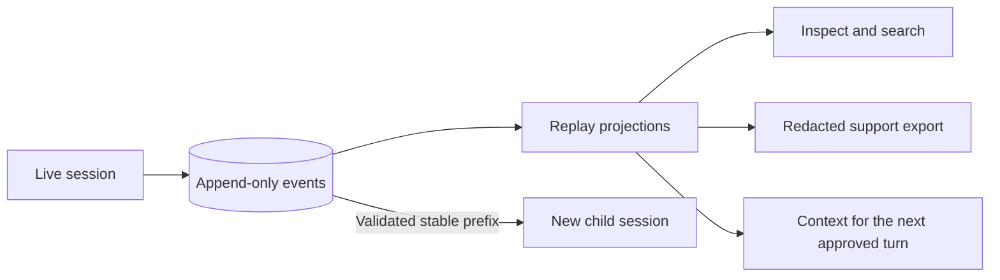

# Sessions and replay

A session contains an append-only event log and redacted artifacts. Replay reads
events in `seq` order and derives session state. It does not execute providers,
tools, hooks, MCP servers, network requests, or CLI commands.



Fork and clone create a new session from a validated prefix. Inspection and replay
leave the source history unchanged.

## CLI inspection

Use the CLI to find and inspect a run:

```bash
harness sessions list
harness sessions inspect <run-id-or-path>
harness sessions tree <run-id-or-path>
harness sessions export --session-dir <session-dir> --output support.json <run-id>
```

`harness sessions continue <run-id-or-path>` resumes through the interactive UI.
`harness sessions fork` creates a child at a selected stable boundary;
`harness sessions clone` copies the latest stable prefix.

`sessions list` intentionally omits `scenario_fixture` runs. Offline list/inspect/reopen QA must
therefore create a successful `harness prompt --mock` operator-mode run inside the isolated session
root; deterministic scenario fixtures remain valid for direct inspect/reopen and replay QA.

`sessions reopen --json` emits one typed response envelope:

```json
{
  "summary": { "run_id": "…", "resumable": true, "…": "SessionRecoverySummary fields" },
  "crash_recovery": { "…": "present only when a previous crash was detected and repaired" }
}
```

Read recovery fields under `summary.*`. The optional `crash_recovery` object
appears only after crash recovery. Older responses duplicated summary fields at
the top level; those duplicate fields are no longer present.

Support export includes replay-derived session metadata, doctor JSON,
configuration and provider summaries, agent and tool catalogs, and session-tool
readiness. The bundle also contains route metadata, an artifact index, a
redaction manifest, and secret-scan status.

Typed extension manifests use the same replay boundary. V1 stores and renders
only static descriptor metadata (`extension.manifest.v1`): extension id,
capability ids, disabled capability ids, descriptor counts, and replay labels.
Replay never discovers manifests, loads extension code, registers tools,
executes commands, launches MCP servers, invokes provider decorators, or mutates
session state to render old extension metadata.

## Model-visible session tools

Agents can inspect saved sessions through these native tools:

| Tool | Purpose |
|---|---|
| `session_list` | Lists sessions from a workspace-safe session root with optional status/profile/resumable/filter/sort/limit fields. |
| `session_read` | Reads a bounded redacted event/message window by run id or safe path selector. |
| `session_search` | Searches safe replay-derived text such as user messages, assistant summaries, tool summaries, titles, and metadata. |
| `session_info` | Reports replay-derived metadata, lineage, status, event counts, artifact summaries, and recovery notes without dumping whole logs. |
| `session_title_update` | Appends an `UpdateSessionTitle` event. Later replay reads the latest title. |

All five tools return structured JSON with `source: "event_replay"`. They redact
output, cap inline results, spill large results to artifacts, and reject path
traversal or selectors outside the session root. The inspection tools do not
execute providers, historical tools, hooks, MCP servers, network requests, or CLI
commands. Model tool calls cannot disable redaction.

`session_read` exposes independent event and message windows: `eventOffset`/`eventLimit` select replay event summaries, while `messageOffset`/`messageLimit` select user-message and assistant-message summaries from the same replay data. For new logs, assistant summaries include committed assistant text plus provider metadata; old logs without self-contained completion parts retain their compatibility shape.

## Resume acceptance

Resume rebuilds the transcript, artifact index, pending permissions, todos, plan
context, provider context, and title from append-only events. This projection is
read-only. New work starts with the next operator-approved turn; crash-tail
repair is described under [failure boundaries](#failure-boundaries).

Session lists and resume views use the recorded title when one exists.
`UpdateSessionTitle` records renames, and replay reads the latest title event.

The runtime captures a workspace snapshot before each assistant tool batch and
stores it as redacted artifacts. Git workspaces use Git's tracked and
non-ignored untracked file list. Binary and sensitive files retain a digest
only. A revert preserves unchanged files and reports changed protected files
without overwriting them. Capture failures or limitations produce an operator
notice.

Dotenv-style secret files are omitted from snapshots and the corresponding
revert scan. `WorkspaceReverted` records a live workspace restore. Replaying
that event does not write workspace files or rewrite `events.jsonl`.

The V1 resume acceptance scenario is a realistic interrupted coding session, not a
single empty run. The fixture records multiple user/provider turns. The guarded
anchors are: loaded skill context; todo checklist state; plan handoff context;
tool artifact references; resolved permission grants; post-resume provider turn.
Resume then restores the historical agent binding, transcript, artifact index,
completed tool state, reusable permission grant, todos, plan handoff, and provider
context before accepting the next turn. The replay and resume rebuild remains
side-effect free; the only new side effects are those requested after the resumed
turn starts.

## Lineage, forks, and clones

`tree` is a replay-derived view of parent/child lineage. `fork` materializes a child session at a stable source cutoff so in-flight provider/tool work is not copied. `clone` copies the latest stable prefix. Summaries, artifacts, and restored context keep their source cutoff semantics: existing artifact references stay tied to the source session, summaries describe the retained prefix, and new child events append only after the materialized boundary.

Active child lineage is replay-visible before completion. Coordinator-owned `TaskScheduled` events may carry typed `metadata.lineage`; child agent-turn schedules include the exact `parent_tool_call_id` and `child_request_id` allocated for that turn. Live and replay projections use those schedule-time ids for parent demotion and watcher deduplication while child tasks are still queued or running. Older logs without `metadata` deserialize with no schedule lineage and retain their existing terminal-metadata fallback behavior.

Fork and clone fail if the source cutoff is unstable or referenced artifacts are
missing. Neither command executes source tools or providers to fill gaps.

Lineage materialization follows the implementation contract in `harness_core::session_lineage`:

- fork materializes an explicitly validated stable prefix. The selected cutoff is recorded as `source_cutoff_seq` in child metadata.
- clone selects the latest stable completed prefix, then records the same `source_cutoff_seq` metadata for the copied boundary.
- Copied events preserve payloads, actors, timestamps, and monotonic times, but `event_id/run_id/seq are regenerated` for the child log. `correlation_id and causation_id are cleared`, and only run-scoped stream keys are rewritten.
- summaries and compaction checkpoints are copied only when copied source events reference them through `SessionCompaction`, `ArtifactWritten`, or tool metadata. In V2, `SessionCompaction` carries the summary and no checkpoint artifact is written; an artifact reference is therefore a legacy compatibility input. Summary text still describes the source prefix that was copied; it is not reinterpreted as new child work.
- Referenced artifacts are `copied after byte and digest validation`. Artifact paths must stay under `artifacts/`, must not traverse symlinks, and missing or mismatched artifacts fail materialization instead of producing a partial child.
- `new child events append after the materialized boundary`. The child replay starts from the rewritten prefix, and future turns add ordinary child-local events after that prefix.
- `restored context is replay-derived from the child log`: resume, session tools, and TUI replay read the child JSONL plus copied artifacts. They do not execute source providers, tools, hooks, MCP servers, shell commands, or network calls to reconstruct fork/clone state.

## Failure boundaries

Corrupt events are reported as parse errors where lossy projection is safe. Missing or ambiguous sessions fail with actionable errors. Replay-only inspection does not prove provider authentication; use a live prompt or live signoff lane for transport/authentication claims. No live-provider assertion is made without configured credentials and a live signoff.

At the event-store boundary, crash-tail recovery is limited to the final JSONL line while holding the writer lock: a partial unterminated final line is truncated to the previous complete event, and a complete final event missing only the newline terminator is normalized before appends continue. Terminated invalid JSON still fails closed. Recovery reads and repairs the log only; it does not execute providers, tools, hooks, MCP servers, shell commands, or network calls.

Session compaction is observable through a single `SessionCompaction` event. Manual `/compact`,
pre-prompt pressure, and the one overflow retry share the coordinator-owned
`prepare -> generate -> validate -> commit` pipeline. Summary generation runs outside the command
loop; a successful commit appends one event and rebuilds provider context from the committed event.
The event's optional typed boundary, token-after estimate, summary usage/provenance, read/modified
file lists, and current intent preserve the canonical state needed by replay. Empty, failing,
cancelled, stale, malformed, or non-fitting generation leaves the previous boundary active and
appends no replacement success event. Overflow retry is bounded to one attempt for the triggering
request.

The deprecated compaction lifecycle variants and checkpoint-artifact readers remain read-only legacy
inputs behind `session::legacy`; they are not active V2 writers. Deprecated variants are matched only inside the read-only `session::legacy` compatibility boundary. New sessions do not create
checkpoint artifacts. Restart and continue rebuild the same provider-visible roles, ordered tool
pairs, attachments, recent suffix, summary, file state, and current intent from replay-derived
events. Replay does not execute providers, tools, hooks, MCP, network, or the CLI.

## Bounded history index and TUI overlays

`harness sessions list` reads the versioned `.session-history-index-v1.json`.
A history-index row is updated after each successful durable commit. The
default page contains at most 50 rows. `--limit`, `--offset`, and the opaque
`cursor` on each JSON row provide newest-first pagination. A cursor includes the
timestamp, run id, and run-directory bytes so equal-time copies cannot collide.
An invalid or stale cursor fails closed with no successful JSON page.

`harness sessions search QUERY` filters indexed run id, title, workspace, and
profile fields. `harness sessions rebuild-index --json` rebuilds from durable
journals. It reports entry count, journal scan count, journal open count, index
path, and recovery reason.

Warm list/search requests still enumerate immediate session directories and compare journal
length/mtime fingerprints, but they do not open every unchanged `events.jsonl`.
The counter reports `warm journal opens: 0`. Missing, stale, unsupported-version, truncated, and corrupt
indexes rebuild. A malformed journal fails closed as an unavailable catalog row and does not remove
healthy rows.

The index is advisory. Inspect, replay, export, reopen, and continue resolve the selected run
directory and validate its source history directly. Replay remains side-effect free and the index
never stores provider continuation authority.

Live provider text, reasoning, and tool-input fragments are an ephemeral TUI overlay. Settling a
turn removes that overlay and displays the single durable semantic assistant commit from
`CanonicalSessionProjection`; replay never reconstructs draft fragments as durable messages.

## Typed canonical read domain

`harness-core::session` defines the typed session model. Its pure reducer reconstructs
parent-linked entries, typed run attempts, session metadata/status, one selected active leaf, and
one deterministic `active_path()`. A read-only `LegacyEventLogAdapter` projects borrowed V1
envelopes into that domain with deterministic namespaced identities, provenance, audit references,
and structured warnings. The adapter exposes no writer and does not open or modify
`events.jsonl`, `meta.json`, locks, indexes, journals, or sidecars.

An entry commit must name a run attempt already started in the same session and that run must still
be active. A terminal run cannot accept later entries, a terminal session cannot accept later
records, and selecting a new leaf rechecks tool-call/result pairing on the selected path. The V1
adapter enforces provider request start, finish, and assistant commit ordering. It also accepts the
historical delta sequence and both turn and tool-call-id correlations found in old logs. Text,
reasoning, tool calls/results, attachments, usage, provenance, title, compaction summary, and branch
summary are preserved where V1 contains enough information. Missing associations and unsupported
or lossy legacy shapes remain explicit `LegacyWarning` values.

Legacy-derived IDs are stable, domain separated, and backed by 128-bit BLAKE3 digests. The adapter
and projection helper implementations are real Rust submodules so source-size and ownership checks
see the same boundaries that the compiler sees.

## Assistant completion and provider fragments

A new assistant completion is self-contained. After provider transport finishes, the coordinator
appends one `AssistantMessageFinished` event with final sanitized reasoning, text, completed tool
intents, provider provenance, and optional assistant message metadata. Conversation, transcript,
canonical session, session inspection, search, export, and resume readers prefer this committed
content over any legacy fragments.

Provider fragments are bounded, lossy, non-replayable runtime events. Connected runtime
subscribers receive text, reasoning, and partial tool input through a 1024-item broadcast channel;
lag can drop fragments. The fragments aren't written to `events.jsonl` and aren't returned by
replay. An interrupted new provider request therefore has no canonical assistant message unless a
final assistant commit was appended.

The legacy `EventV1` delta variants remain decode-only. Old partial logs remain readable:
compatibility projections can preserve their partial assistant text or reasoning and report a
structured missing-final-content warning. Defaulted `parts` and `provenance` fields also let old
`AssistantMessageFinished` records decode unchanged.

The coordinator still appends V1 `events.jsonl`, while new compaction uses the typed
`SessionCompaction` path. The shipped `EventV1` variant count remains 39 for journal
compatibility. Deprecated shapes are read-only compatibility input and are matched only inside the
`session::legacy` boundary; active writers do not append them.

## Canonical provider continuation

Provider continuation uses the same typed view after a live turn and after reopen. The view carries
the owning agent/session, selected active leaf and watermark, ordered protocol-safe entries, the
latest compaction summary, complete tool-call/result pairs, typed attachments, usage boundaries,
pending prompt, and redacted runtime selection. The runtime selection persists provider/model,
variant, reasoning and thinking settings, resolved limits, and the profile/tool-shape digest;
`lower_provider_continuation` rejects a current profile/tool-shape mismatch before dispatch.

Replay and restore only derive this view and its provider context. They do not execute a provider,
tool, hook, MCP server, network request, scheduler, or writer. The lowerer adds the pending prompt
as a transient continuation input, lowers canonical attachments once, and sets the media flag from
the canonical attachment set. Request comparison evidence removes only the fresh physical
`context.request_id`; semantic fields and the full 64-hex request digest remain in scope.

The settled read boundary now constructs one authoritative composed `CanonicalSessionProjection` facade per journal load or settlement. Its focused pure reducers remain independently evaluated; it is neither a monolithic reducer nor a single physical pass. Provider continuation, restart, replay, export, catalog inspection, and settled TUI state read that facade. The TUI owns only ephemeral overlays and presentation enrichment, never durable session semantics.
