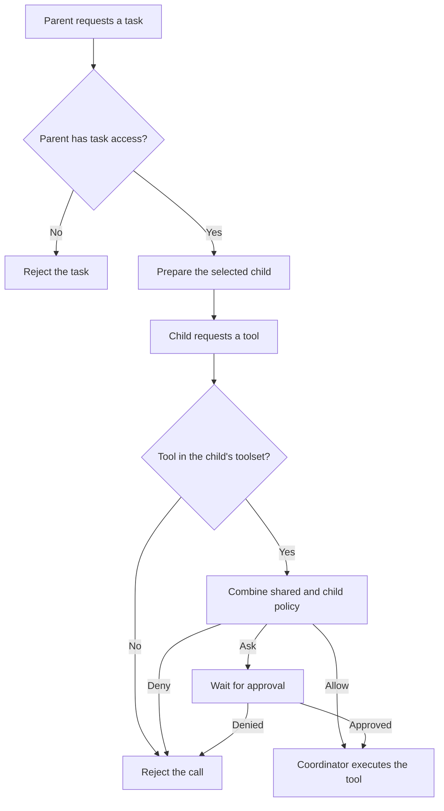

# Agents and tasks

Harness uses one generic parent agent for interactive turns. It can delegate
bounded work to `explore`, `general`, or `librarian`. There is no primary-role
picker, category router, or separate planning agent.

Title generation and context compaction are internal coordinator operations.
Their prompts receive no tools and do not appear in the agent catalog.

## Generic execution configuration

The top-level `model` selects the parent's model. `agent.default` can override
its prompt, variant, sampling, tools, permissions, iteration budget, and tool
failure behavior. Named subagent entries configure their own prompts and tools.

Events identify the parent as `default` and children by their selected subagent
ID. Configuration changes do not rewrite historical profile strings.

## Permission and toolset boundaries

The coordinator checks each agent's own toolset and permissions. A parent's
`task` permission controls whether it can start or continue a child. Its other
role restrictions do not transfer to that child. For example, a parent denied
native editing can delegate implementation to `general` if shared policy allows
it.

For child actions, the coordinator combines shared project policy with the
child's role policy. Deny wins, then ask, then allow. An existing grant can
satisfy an ask but cannot override a deny. Calls inside `batch` follow the same
checks. Primary-agent permission precedence is unchanged.

| Role | Default tools |
| --- | --- |
| `explore` | `read`, `glob`, `grep`, `list`, `ast_grep_search`, `webfetch`, `websearch`, `session_list`, `session_read`, `session_search`, `session_info`, `batch`, `bash`, `lsp`, `skill` |
| `librarian` | Explore's tools plus `codesearch` |
| `general` | Librarian's native tools except `skill`, plus `edit`, `write`, `apply_patch` |
| `default` | Parent tools, including task delegation and skill loading |

Research roles deny native editing, questions, delegation, and todo mutation.
They can use bash, LSP queries, and skills. Their prompts require research, but
bash and MCP can still mutate files. An edit deny therefore does not confine the
filesystem. `lsp.rename` remains unavailable to research roles.

MCP discovery adds concrete configured tools to `default`, `explore`, and
`librarian`, even with customized native tool lists. General requires exact MCP
IDs in its tool list. Stdio MCP uses the `bash` capability; HTTP MCP uses network
policy. Both shared and role policy apply. Discovery does not add generic MCP
gateway tools.

Skills provide instructions and cannot grant tools. The `skill` tool uses read
permission and the per-skill load policy. General receives skills through the
parent's `load_skills` argument. Task results report the child's prepared toolset;
individual arguments can still trigger an ask or deny.

Resume prepares children from current configuration, using the same checks as a
new spawn. It does not restore old policy snapshots. See the
[permission guide](../permissions/permissions.md) for the limits of these checks.

## Structured delegation body

New `task` calls require `subagent_type`, `prompt`, `run_in_background`, and
`load_skills`. Continuations identify the child with `task_id` or `session_id`.
For work that needs context, include these details in the prompt:

| Detail | What to tell the child |
| --- | --- |
| Context | Relevant files, modules, constraints, and prior work |
| Goal | The decision or artifact to produce |
| Downstream use | How the parent will use the result |
| Request | The work and expected output format |
| Required tools | Tools to use or avoid |
| Required checks | Tests or other evidence the task needs |
| Scope limits | Files, actions, and capabilities outside the task |

Duplicate `load_skills` names load once, at their first occurrence. Missing,
denied, disabled, malformed, or unsafe symlinked skills fail the call before the
child starts. The skill catalog reports `body_loaded: false` until activation.

The runtime caps and redacts summaries returned by synchronous `task` calls or
`background_output`. Truncation metadata, the child session ID, and next actions
let the parent retrieve more output or continue the child.

## Enforcement boundary

The coordinator owns event appends, scheduling, child ownership, cancellation,
permissions, and tool execution. Prompt text and TUI labels cannot grant access
or bypass those checks.
