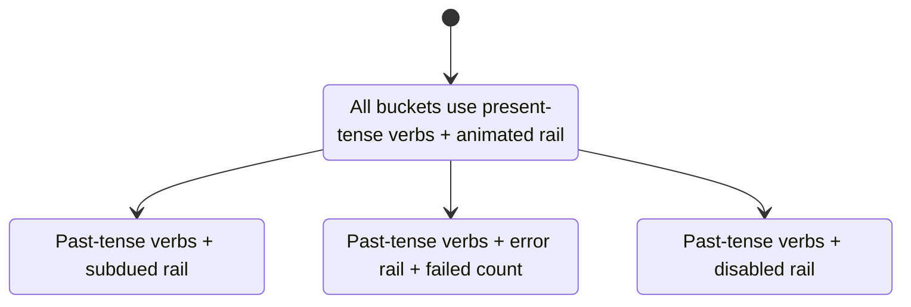
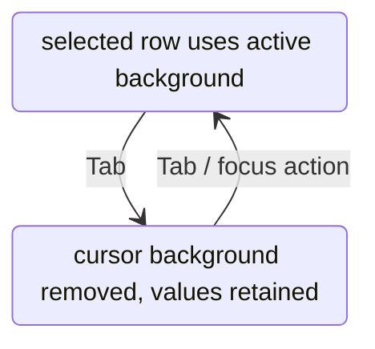
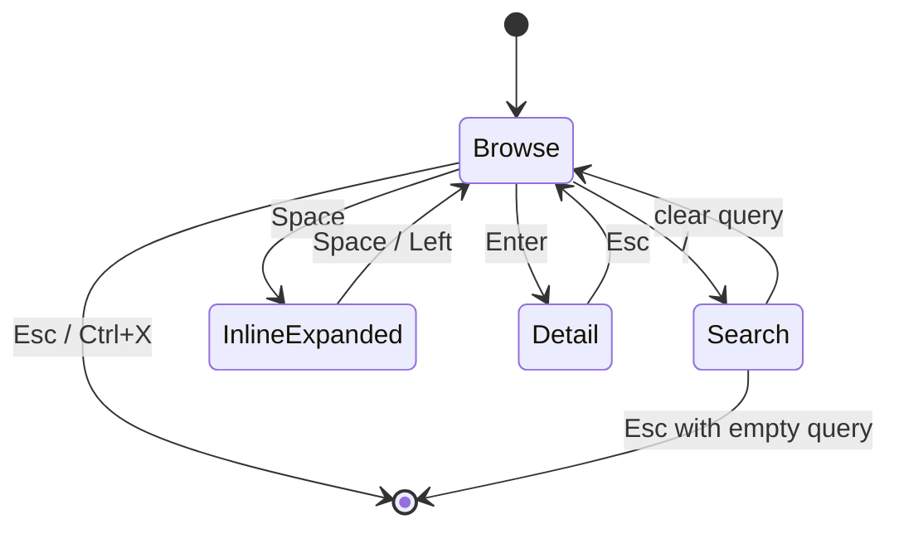
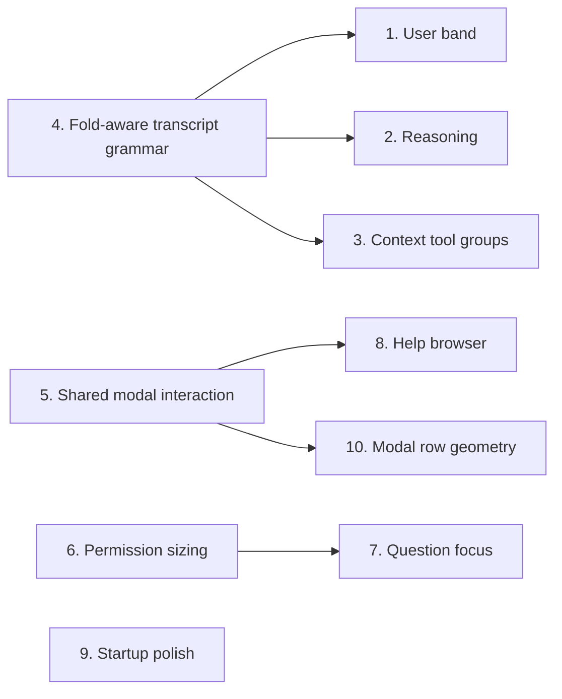

# Grok Build TUI Visual Parity Guide

> **Status:** Advisory implementation guide, not an acceptance receipt or parity claim.  
> **Reference authority:** [`configs/tui-fidelity-reference-authority.json`](configs/tui-fidelity-reference-authority.json)  
> **Harness design contract:** [`crates/harness-tui/DESIGN.md`](crates/harness-tui/DESIGN.md)

This guide turns the current source-backed Grok Build comparison into ten independently assignable visual-improvement tasks. It is intentionally narrower than the full parity contract in [`docs/reference/grok-build-tui-implementation-prompt.md`](docs/reference/grok-build-tui-implementation-prompt.md).

The main conclusion is simple:

> **Do not spend the next implementation cycle recoloring the whole TUI or rebuilding its basic shell.** Harness already maps the Grok-derived palette and closely matches the bordered composer, welcome panel, completion line, and primary shell topology. The largest remaining differences are transcript hierarchy, stateful activity presentation, and overlays that look interactive but expose fewer interaction states.

## How to read this guide

- **Current** means current Harness source behavior established from the cited renderer or state owner.
- **Target** means the observable grammar in the checked-out `inspirations/grok-build` source.
- Terminal drawings are explanatory wireframes, not pixel evidence.
- Grok source, tests, copy, art, and identifiers are inspection material only. Implement all Harness changes independently.
- Historical screenshots help show visual magnitude, but fresh current-revision dual captures remain the acceptance authority.
- Each implementation prompt is self-contained and can be assigned separately.

## Surface map

```text
┌─ project / branch / context ───────────────────────────────────────────────┐
│                                                                           │
│  [1] USER TURN BAND                                                       │
│  [2] THINKING / REASONING                                                 │
│  [3] CONTEXT AND TOOL GROUPS                                              │
│  [4] FOLD-AWARE VERTICAL RHYTHM                                           │
│                                                                           │
│  assistant prose, markdown, code, diffs                                   │
│                                                                           │
├─ [6] PERMISSION or [7] QUESTION DOCK, when active ────────────────────────┤
│                                                                           │
├─ composer ───────────────────────────────────────────────────── model/mode ┤
└─ shortcuts / status ──────────────────────────────────────────────────────┘

                    ┌─ [5] SHARED MODAL CHROME ─────────────┐
                    │ [8] Help browser                       │
                    │ [10] Inset selection and hover rows    │
                    └─────────────────────────────────────────┘

Startup-only surface: [9] compact prompt alignment and logo shimmer.
```

## Priority summary

| Rank | Change | Impact | Effort | Primary surface | Depends on |
|---:|---|---|---|---|---|
| 1 | Match the user-message band | High | S | Transcript | 4 recommended first |
| 2 | Quiet the thinking/reasoning treatment | High | M | Transcript | 4 recommended first |
| 3 | Use semantic context-tool groups and state rails | High | L | Transcript | 4 recommended first |
| 4 | Make transcript spacing fold-aware | Medium-high | M | Transcript grammar | None |
| 5 | Give shared modal chrome real mouse behavior | Medium-high | L | Overlays | None |
| 6 | Make permission height content-driven | Medium-high | M | Permission dock | None |
| 7 | Dim question selection when focus leaves | Medium | S | Question dock | None |
| 8 | Turn Help into a real shortcut browser | Medium | M | Help overlay | 5 |
| 9 | Finish startup-specific parity polish | Medium | M | Welcome/startup | None |
| 10 | Inset modal selection and hover bands | Medium-low | S-M | Overlay lists | 5 |

---

## 1. Match Grok's user-message band

**Impact:** High  
**Effort:** Small  
**Why first:** Every conversation turn exposes this difference.

Harness already matches the elevated three-row band, three-line collapse behavior, and right-aligned short clock. The first version of this guide incorrectly treated the clock as a Harness-only element because it compared Grok's block-local `UserPromptBlock` output with Harness's final composed row. Grok adds the clock later in `EntryRenderer`.

The confirmed marker difference is `›` versus Grok's `❯`. Final gutter geometry must be compared after Grok's wrapper chrome is applied, not from the block-local prefix alone. Timestamp parity concerns visibility defaults, reserved width, narrow-terminal suppression, and hover expansion, not removal.

### Current Harness

```text
░░░░░░░░░░░░░░░░░░░░░░░░░░░░░░░░░░░░░░░░░░░░░░░░░░░░░░░░░░
░░░   › Ship the elevated user-message band.              12:34 PM ░░░
░░░░░░░░░░░░░░░░░░░░░░░░░░░░░░░░░░░░░░░░░░░░░░░░░░░░░░░░░░
```

The timestamp itself is correct and should remain. Grok reserves ten columns so body wrapping cannot collide with it, suppresses it when the row is too narrow, and expands it on hover from `12:34 PM` to a detailed form such as `12:34:56 | Aug 16`.

### Grok target

```text
░░░░░░░░░░░░░░░░░░░░░░░░░░░░░░░░░░░░░░░░░░░░░░░░░░░░░░░░░░
░❯ Ship the elevated user-message band.                    12:34 PM ░
░░░░░░░░░░░░░░░░░░░░░░░░░░░░░░░░░░░░░░░░░░░░░░░░░░░░░░░░░░
```

Wrapped continuation rows align under the body, not under the prompt arrow:

```text
❯ This is a long user message that wraps onto a second line while keeping
  the continuation text aligned with the first character of the body.
```

### Visual delta

```diff
-   › message text                                             12:34 PM
+   ❯ message text                                             12:34 PM
```

Timestamp behavior:

| State | Grok target |
|---|---|
| Normal | Right-aligned `h:mm AM/PM` |
| Hovered | Expanded `HH:mm:ss | Mon DD` |
| Narrow row | Suppressed when it cannot fit safely |
| Disabled | Hidden through the timestamps setting |
| Thinking/tool rows | No timestamp |

### Source evidence

- Harness user surface: `crates/harness-tui/src/ui_transcript_render.rs:237`
- Harness marker construction: `crates/harness-tui/src/ui_transcript_render.rs:394`
- Harness clock packing: `crates/harness-tui/src/ui_transcript_render.rs:483`
- Grok prompt band and prefix: `inspirations/grok-build/crates/codegen/xai-grok-pager/src/scrollback/blocks/user.rs:197`
- Grok timestamp eligibility and width reservation: `inspirations/grok-build/crates/codegen/xai-grok-pager/src/scrollback/wrappers/entry_renderer.rs:392`
- Grok short and hover-expanded timestamp overlay: `inspirations/grok-build/crates/codegen/xai-grok-pager/src/scrollback/wrappers/entry_renderer.rs:952`

<details>
<summary><strong>Copy-ready implementation prompt</strong></summary>

```text
Implement Grok-faithful user-message bands in agent-harness.

Before editing, load karpathy-guidelines, programming, rust-best-practices, frontend, and visual-qa. Read the root AGENTS.md, crates/harness-tui/AGENTS.md, and crates/harness-tui/DESIGN.md. Treat inspirations/grok-build as read-only behavioral evidence; do not copy or mechanically translate its source.

Change only the user-prompt transcript surface and its typed wrapper/layout helpers. Match Grok's `❯` marker while preserving the three-row elevated band, selected/active-thinking surfaces, queued state, collapse limit, wrapping, CJK width handling, transcript selection, and timestamp.

Do not remove the wall clock. Match the current pinned Grok wrapper behavior: reserve timestamp width before wrapping, render the short `h:mm AM/PM` form at the right edge, suppress it safely at narrow widths, expand it to `HH:mm:ss | Mon DD` when the timestamp hit region is hovered, and honor the timestamps visibility setting. Confirm final marker inset against a full reference capture because Grok's wrapper adds chrome outside `UserPromptBlock`.

Add or update exact responsive tests at 60x20, 79x24, 80x24, 100x30, 120x40, and 132x40. Run the user-message responsive suite, harness-tui deterministic render tests, baseline-stream/baseline-complete fidelity comparisons, signoff-pty, and offline dogfood.

Stop when the user band matches the current reference outside declared identity fields and no wrapping, selection, or replay behavior regresses.
```

</details>

---

## 2. Make thinking quiet instead of tool-like

**Impact:** High  
**Effort:** Medium  
**Why it matters:** Reasoning appears frequently and currently competes visually with tool execution.

### Current Harness state ladder

```text
ACTIVE, COLLAPSED
⠋ Thinking… ▸                 purple/accent marker

ACTIVE, PREVIEW
⠋ Thinking… ▸

  …
  most recent reasoning line
  another recent reasoning line

SETTLED, COLLAPSED
◆ Thought for 2.3s ▸          tool-like diamond + disclosure
```

### Grok target state ladder

```text
ACTIVE, COLLAPSED
Thinking…                     muted bold

ACTIVE, EXPANDED
Thinking…

reasoning body rendered with subdued markdown

SETTLED, COLLAPSED
Thought for 2.3s              muted label + muted duration
```

### Hierarchy comparison

```diff
-⠋ Thinking… ▸
-◆ Thought for 2.3s ▸
+Thinking…
+Thought for 2.3s
```

The target still supports folding. It simply does not style completed thinking like a completed tool call.

### Source evidence

- Harness reasoning header: `crates/harness-tui/src/ui_transcript_render.rs:1115`
- Harness active accent marker: `crates/harness-tui/src/ui_transcript_render.rs:1139`
- Grok muted header treatment: `inspirations/grok-build/crates/codegen/xai-grok-pager/src/scrollback/blocks/thinking.rs:220`
- Historical synchronized comparison: `artifacts/qa-evidence/20260801-grok-chat-shell-parity-final/comparisons-v11/grok-vs-harness-thinking-animation-same-state.png`

<details>
<summary><strong>Copy-ready implementation prompt</strong></summary>

```text
Restyle Harness reasoning blocks to match Grok's quiet Thinking/Thought hierarchy.

Load the required Rust, programming, frontend, and visual-qa skills. Read the project and harness-tui AGENTS files plus DESIGN.md. Inspect Grok's current thinking.rs and appearance defaults as read-only evidence; author the Harness implementation independently.

In crates/harness-tui/src/ui_transcript_render.rs, ui_reasoning_markdown.rs, and ui_transcript_style.rs:
- Replace the purple tool-like marker treatment with muted semantic text.
- Render active state as a subdued "Thinking…" header.
- Render completion as "Thought" or "Thought for <duration>".
- Do not use the tool diamond for settled reasoning.
- Show disclosure chrome only when it communicates a real expandable state.
- Match Grok's collapsed, active-preview, expanded, completed, hidden, and reduced-motion states.
- Remove unnecessary blank rows while preserving readable expanded markdown.
- Keep existing redaction, selection, replay, and reasoning state semantics unchanged.

Add ordered-frame tests for active-to-completed reasoning, expanded/collapsed snapshots, reduced-motion coverage, and a synchronized visual comparison against baseline-stream and baseline-complete.

Stop when reasoning is visually distinct from tool execution and matches Grok's muted hierarchy across rest, running, expanded, and settled states.
```

</details>

---

## 3. Use semantic context-tool groups and state rails

**Impact:** High  
**Effort:** Large  
**Boundary:** Command groups are already close. Concentrate on read/search/list/context groups.

### Current Harness

```text
Gathered context · 1 read · 2 searches · 1 list ▸
  Read src/main.rs
  Search "render_app"
  Search "Theme"
  List crates/harness-tui/src
```

The header describes an internal category, not the work the user can scan. Aggregate state is mostly encoded in text color.

### Grok target

```text
┃  ◈ Reading 1 file, Searching 2 patterns, Listing 1 dir
```

Collapsed groups hide their members. Expanding keeps the header in place and
reveals every member below it:

```text
┃  ◈ Reading 1 file, Searching 2 patterns, Listing 1 dir
┃  ◆ Read src/main.rs
┃  ◆ Search "render_app"
┃  ◆ Search "Theme"
┃  ◆ List crates/harness-tui/src
```

Settled state changes tense:

```text
❙  ◈ Read 1 file, Searched 2 patterns, Listed 1 dir
```

Failure or active state remains visible down the left edge:

```text
┃  active animated rail
┃  failed error rail
❙  settled dim rail
```

### State grammar



### Source evidence

- Harness group renderer: `crates/harness-tui/src/ui_transcript_render.rs:1264`
- Harness group rail disabled: `crates/harness-tui/src/ui_transcript_render.rs:1552`
- Grok semantic group labels: `inspirations/grok-build/crates/codegen/xai-grok-pager/src/scrollback/state/verb_group.rs:177`

<details>
<summary><strong>Copy-ready implementation prompt</strong></summary>

```text
Rebuild Harness context-tool groups around Grok's semantic verb grammar and state rails.

Load the required coding and visual skills, then read all applicable AGENTS.md files and DESIGN.md. Inspect Grok's verb_group and entry_renderer code as behavioral evidence only.

Scope this to read, search, grep, glob, list, skill, MCP-context, and similar non-command activity. Preserve the existing command-group presentation unless a current reference comparison proves a specific mismatch.

Replace generic "Gathering/Gathered context" summaries with ordered verb-led phrases derived from structured tool identity:
- "Reading 3 files" while active
- "Read 3 files" when settled
- "Searched 2 patterns"
- "Listed 1 dir"
- analogous truthful verbs for other supported families

Use `◈` for the aggregate header. Add a one-cell rail: heavy `┃` while running or failed, dim `❙` when settled. Failure takes visual precedence over running; cancelled members do not count as failed. Preserve collapsed-by-default disclosure, hit testing, copy behavior, scroll anchors, and event-derived ordering. Fold from the first member, hide members while collapsed, and reveal them below the stable header when expanded.

Tense is aggregate-wide: if any member is running, every bucket uses present tense. Preserve first-seen bucket order rather than sorting by family.

Keep all grouping typed and projection-driven. Do not parse rendered strings to infer tool families.

Add owner tests for mixed verbs, present/past tense, failures, running groups, hidden-member counts, expansion, replay, and accessibility fallbacks. Verify with baseline-tool, baseline-stream, deterministic transcript snapshots, signoff-pty, and offline dogfood.

Stop when context-heavy turns scan like Grok's verb groups without regressing command groups or tool authority.
```

</details>

---

## 4. Make transcript spacing depend on fold state

**Impact:** Medium-high  
**Effort:** Medium  
**Architectural role:** This is the grammar foundation for items 1-3.

Harness currently decides several gaps from semantic role alone. Grok decides whether to pack neighboring entries using both grouping and fold state.

### Correct collapsed density

```text
◆ Read src/main.rs
◆ Search "render_app"
◆ List crates/harness-tui/src
```

There are no blank rows because both neighbors are groupable and collapsed.

### Correct expanded separation

```text
◆ Read src/main.rs ▾
  1  fn main() {
  2      run();
  3  }

◆ Search "render_app" ▸
```

The expanded body earns a separator row. It must not visually merge into the next tool.

### Pairwise rule

```text
neighbor A visible? ── no ──► skip it
       │ yes
       ▼
neighbor B visible? ── no ──► trailing gap = 1
       │ yes
       ▼
A groupable AND B groupable AND A collapsed AND B collapsed?
       │ yes                         │ no
       ▼                             ▼
    gap = 0                       gap = 1
```

### Source evidence

- Harness role-based gap function: `crates/harness-tui/src/ui_transcript_block_grammar.rs:82`
- Grok pairwise fold-aware rule: `inspirations/grok-build/crates/codegen/xai-grok-pager/src/scrollback/state/layout.rs:1539`

<details>
<summary><strong>Copy-ready implementation prompt</strong></summary>

```text
Replace Harness's role-only transcript gap table with fold-aware pairwise spacing.

Load the mandatory coding skills and read the TUI design and rendering guidance. Keep the change in the transcript grammar/layout layer rather than patching individual painters.

Model enough presentation state on normalized transcript blocks to determine:
- whether each block is groupable,
- whether it is collapsed, previewing, or expanded,
- whether it is hidden,
- whether it is the final visible block.

Implement the reference rule:
- zero gap only when both neighboring visible blocks are groupable and collapsed,
- otherwise one separator row,
- hidden reasoning is transparent when finding the next visible neighbor,
- preserve the required trailing gap and pinned-footer behavior.

Do not derive spacing from rendered line contents. Preserve selection anchors, incremental layout caching, fold expansion, tool-group navigation, and scroll follow state.

Add matrix tests covering tool/tool, tool/reasoning, reasoning/tool, assistant/reasoning, collapsed/expanded permutations, hidden reasoning, final entries, and permission/question pinned footers. Run transcript integration, scroll, selection, performance, baseline-tool, baseline-diff, and signoff-pty tests.

Stop when expanding or collapsing a block changes only the separators Grok changes and never merges expanded bodies into adjacent activity.
```

</details>

---

## 5. Give all modal chrome real mouse behavior

**Impact:** Medium-high  
**Effort:** Large  
**Why it matters:** Harness overlays visually expose buttons, tabs, rows, scrollbars, and footer actions that are not all pointer-active.

### Current interaction boundary

```text
special-cased surfaces
    ├─ file mention           mouse-aware
    ├─ slash completion       mouse-aware
    ├─ status dialog          mouse-aware
    └─ permission prompt      mouse-aware

generic overlay stack
    └─ pointer interaction blocked
```

### Target shared modal contract

```text
┌─ Keyboard Shortcuts ───────────────────────────────────────────── [✗] ─┐
│ [All] [Input] [Navigation]                                               │
│                                                                           │
│ Search: _                                                                 │
│                                                                           │
│  ◆ selected row                                            keyboard focus │
│    hovered row                                              mouse hover    │
│    normal row                                                              │
│                                                                      █     │
│                                                                           │
│            ↑/↓ nav  |  Enter open  |  Esc close                          │
└───────────────────────────────────────────────────────────────────────────┘
```

Interactive regions:

```text
[✗]             hover + click
[tabs]          hover + click
[search]        click to focus
[rows]          hover + click
[scrollbar]     wheel + drag where supported
[footer action] hover + click when actionable
[outside popup] dismiss when contract allows
```

### Source evidence

- Harness pointer boundary: `crates/harness-tui/src/app/mouse_interaction.rs:864`
- Generic overlay block: `crates/harness-tui/src/app/mouse_interaction.rs:907`
- Grok modal chrome routing: `inspirations/grok-build/crates/codegen/xai-grok-pager/src/views/modal_window.rs:1034`

<details>
<summary><strong>Copy-ready implementation prompt</strong></summary>

```text
Introduce one shared mouse and hit-map contract for Harness modal overlays.

Load Rust, programming, frontend, and visual-qa skills. Read TUI AGENTS.md, app/AGENTS.md, DESIGN.md, and the existing overlay stack rules. Grok modal_window.rs and picker.rs are read-only behavioral references.

Create reusable per-frame hit regions for:
- close button,
- tabs,
- search/input area,
- list rows,
- scrollbars,
- footer shortcuts,
- popup bounds for outside-click dismissal.

Route mouse move, down, up, drag, and wheel events through the current top overlay only. Add distinct hover state without changing keyboard selection. Preserve permission-before-execution, overlay z-order, focus restoration, keyboard-only operation, and replay safety.

Migrate command palette, model selector, session picker, help, theme/settings selectors, and other applicable generic overlays to the shared contract. Do not invent clickable actions where the product surface has no corresponding command.

Add tests for hover entry/exit, press-release matching, outside click, tabs, footer actions, wheel scrolling, overlay preemption, resize invalidation, and stale hit maps. Verify baseline-modal-surfaces, baseline-mouse, deterministic render tests, signoff-pty, and offline dogfood.

Stop when every visually interactive modal element either works with the pointer or is no longer styled as interactive.
```

</details>

---

## 6. Make permission height follow its content

**Impact:** Medium-high  
**Effort:** Medium  
**Invariant:** Permission checks and decisions remain coordinator-owned.

### Current fixed presentation

```text
transcript
──────────────────────────────────────────────────────────────────────
❙ Permission required
❙ command or summary clipped into a small body budget
❙
❙ Allow once
❙ Always allow
❙ Deny
❙ Esc cancel
──────────────────────────────────────────────────────────────────────
composer
```

Short and long permission requests occupy nearly the same dock structure.

### Target content-driven presentation

```text
SHORT REQUEST                         LONG REQUEST
┌──────────────────────────┐          ┌────────────────────────────────┐
│ Permission required      │          │ Permission required            │
│ Read config.toml         │          │ subagent provenance            │
│                          │          │ wrapped command or MCP args     │
│ Allow once               │          │ scope and edit hints            │
│ Always allow             │          │ … Ctrl-F expand                 │
│ Deny                     │          │                                │
└──────────────────────────┘          │ Allow once / Always / Deny     │
                                      └────────────────────────────────┘
                                      capped near 50% of viewport
```

Expanded state may use more of the screen, but normal state should remain bounded.

### Source evidence

- Harness permission dock constants: `crates/harness-tui/src/layout/surfaces.rs:89`
- Grok measurement and cap: `inspirations/grok-build/crates/codegen/xai-grok-pager/src/views/permission_view.rs:478`

<details>
<summary><strong>Copy-ready implementation prompt</strong></summary>

```text
Implement content-driven permission-dock height in Harness.

Load all required coding and visual skills. Read the coordinator/permission invariants before editing. Change presentation measurement only; permission authority and decision semantics must remain coordinator-owned.

Measure the rendered rows for:
- provenance/subagent context,
- title and summary,
- wrapped bash command or tool description,
- MCP arguments,
- editable scope/pattern hints,
- decision choices,
- footer controls.

Retain a compact minimum, cap normal height at approximately half the viewport, and add an explicit expansion/collapse path for long content. On very short terminals, prioritize decision rows and a truthful truncation indicator. Keep the transcript, composer draft, focus owner, and scroll position stable while resizing or expanding.

Unify rendering and hit-testing around the same measurement result so pointer regions cannot drift.

Add tests for short and long commands, MCP payloads, provenance, expanded/collapsed state, 60x20 through 140x40 viewports, CJK wrapping, permission timeout state, and mouse/keyboard selection. Compare baseline-permission and baseline-reduced-capabilities, then run signoff-pty and dogfood.

Stop when short permissions stay compact and long permissions expose enough decision context without covering the entire transcript by default.
```

</details>

---

## 7. Dim question selection when focus leaves the prompt

**Impact:** Medium  
**Effort:** Small  
**Goal:** Exactly one surface should look keyboard-active.

### Current ambiguous focus

```text
FOCUS: SCROLLBACK

❙ Which color?
❙ █ A  Red          still painted as active cursor row
❙   B  Green
❙   C  Blue
❙
❙ Tab:prompt  Enter:select
```

### Target focus hierarchy

```text
FOCUS: QUESTION PANEL                FOCUS: SCROLLBACK

❙ Which color?                      ❙ Which color?
❙ █ A  Red        active cursor     ❙   A  Red        committed state only
❙   B  Green                        ❙   B  Green
❙   C  Blue                         ❙   C  Blue
```

Mouse hover remains separate from both keyboard cursor and committed multi-select state.

### Focus state diagram



### Source evidence

- Harness question renderer: `crates/harness-tui/src/ui_permission_dock.rs:450`
- Harness selected-row paint: `crates/harness-tui/src/ui_permission_dock.rs:564`
- Grok focus-sensitive row style: `inspirations/grok-build/crates/codegen/xai-grok-pager/src/views/question_view.rs:1324`

<details>
<summary><strong>Copy-ready implementation prompt</strong></summary>

```text
Make Harness question-prompt styling reflect actual focus ownership.

Load the required skills and read the TUI/app focus and permission guidance. Do not change question answers, coordinator state, or keybindings.

Pass the current focus owner into render_question_permission_dock. When the question panel owns focus:
- show the selected cursor-row background,
- use the normal primary/accent treatment.

When focus moves to transcript/scrollback:
- remove the active cursor-row fill,
- retain checked/multi-select state without presenting it as the current cursor,
- dim the panel consistently with Grok,
- keep the draft, selection index, and scroll offset unchanged.

Mouse hover must remain distinct from keyboard cursor and committed selection.

Add focused/unfocused snapshots, Tab-to-scrollback and return-focus tests, multi-select coverage, freeform input coverage, mouse hover tests, and permission preemption tests. Verify baseline-question and baseline-mouse.

Stop when there is exactly one visually active focus owner at all times.
```

</details>

---

## 8. Turn Help into a real shortcut browser

**Impact:** Medium  
**Effort:** Medium  
**Dependency:** Build on the shared modal interaction contract from item 5.

Harness currently paints controls that imply a state machine:

```text
↑/↓ nav | Space expand | ← collapse | Enter open
/ search | Esc close
```

The visible body is mostly static. The target supports browse, search, inline expansion, collapsed sections, and detail pages.

### Target interaction model



### Target browse view

```text
┌─ Keyboard Shortcuts ───────────────────────────────────────────── [✗] ─┐
│ Search: _                                                                 │
│───────────────────────────────────────────────────────────────────────────│
│ Essentials                                                                │
│ █ Enter       Send prompt                                                  │
│   Tab         Focus scrollback                                             │
│   Ctrl+P      Command palette                                              │
│                                                                           │
│ › Input                                                     5 shortcuts    │
│ › Conversation Navigation                                  10 shortcuts    │
│ › Session                                                   3 shortcuts    │
│                                                                           │
│      ↑/↓ nav | Space expand | Enter open | / search | Esc close           │
└───────────────────────────────────────────────────────────────────────────┘
```

### Target detail view

```text
┌─ Keyboard Shortcuts ───────────────────────────────────────────── [✗] ─┐
│ Submit prompt                                                             │
│ Enter                                                                     │
│                                                                           │
│ Sends the current draft when the composer owns focus.                     │
│                                                                           │
│                    Esc back | ↑/↓ scroll | Ctrl+X close                    │
└───────────────────────────────────────────────────────────────────────────┘
```

### Source evidence

- Harness Help rows: `crates/harness-tui/src/ui_secondary_events_tab.rs:163`
- Harness advertised controls: `crates/harness-tui/src/ui_secondary_events_tab.rs:182`
- Harness open/close action only: `crates/harness-tui/src/app/key_interaction.rs:1065`
- Grok detail state and rendering: `inspirations/grok-build/crates/codegen/xai-grok-pager/src/views/shortcuts_help.rs:610`

<details>
<summary><strong>Copy-ready implementation prompt</strong></summary>

```text
Replace Harness's static Help overlay with a searchable, navigable shortcut browser.

Implement this after the shared modal mouse contract. Load the required coding and visual skills and read the keybinding, app-state, and overlay guidance.

Add a dedicated Help state model containing:
- query and search-active state,
- selected row,
- collapsed section set,
- inline-expanded row,
- optional detail page with scroll offset,
- mouse hover,
- return state for Esc/back.

Generate all rows from Harness's real keybinding/action registry. Do not duplicate shortcut strings in the renderer. Only advertise actions that are implemented.

Support keyboard and mouse navigation, search, expand/collapse, detail open/back, scrolling, close, overlay preemption, resize, and focus restoration. Preserve replay-specific messaging and the prior composer draft.

Add pure state tests plus deterministic render and PTY journey tests. Verify baseline-modal-surfaces and baseline-mouse after the shared modal behavior work lands.

Stop when every footer hint shown by Help performs the advertised action and all shortcut text comes from one authoritative binding source.
```

</details>

---

## 9. Finish startup-specific parity polish

**Impact:** Medium, startup-only  
**Effort:** Medium  
**Scope:** Keep Harness identity and product copy. Match geometry, material, and motion.

### Compact prompt geometry

Current Harness reuses a live-shell inset:

```text
 ┌──────────────────────────── 58 cells ────────────────────────────┐
 │ ❯                                                               │
 └──────────────────────────────────────────────────────────────────┘
```

Grok's compact startup prompt is flush to the 60-column viewport:

```text
┌────────────────────────────── 60 cells ────────────────────────────┐
│ ❯                                                                │
└───────────────────────────────────────────────────────────────────┘
```

The live-shell composer should remain unchanged unless separately remeasured.

### Logo material

Current Harness:

```text
STATIC FRAME
████ Harness mark ████       one secondary gray
```

Grok target:

```text
FRAME 0              FRAME 1              FRAME 2
░░▒▒▓▓ logo          ░▒▒▓▓▒ logo          ▒▓▓▒▒░ logo
   diagonal highlight sweeps bottom-left → top-right
```

The sweep is slow, rests between passes, and falls back to static or hidden output when terminal capabilities require it.

### Motion states

```text
enhanced + motion enabled   → 12 fps quantized shimmer
enhanced + reduced motion   → static resting gray
legacy / unsupported glyph → hide logo or use existing safe fallback
welcome dismissed          → no further logo redraw demand
```

### Source evidence

- Harness startup dock centering: `crates/harness-tui/src/layout.rs:1019`
- Grok compact prompt inset: `inspirations/grok-build/crates/codegen/xai-grok-pager/src/views/welcome/prompt.rs:10`
- Harness static logo paint: `crates/harness-tui/src/ui_lifecycle.rs:462`
- Grok shimmer cadence and blend: `inspirations/grok-build/crates/codegen/xai-grok-pager/src/views/welcome/logo.rs:58`

<details>
<summary><strong>Copy-ready implementation prompt</strong></summary>

```text
Implement the remaining startup-only Grok fidelity details in Harness.

Load the required Rust/frontend/visual skills. Read DESIGN.md and the startup/welcome owner tests. Keep Harness identity and copy; match only geometry, material, and motion.

Geometry:
- At compact startup widths, use a flush-width bordered composer matching Grok's welcome prompt.
- Do not change live-shell composer geometry unless separately measured.
- Preserve model badge placement, cursor position, warning rows, footer, and draft clear-on-first-input choreography.

Logo:
- Add a slow diagonal shimmer that blends the resting logo gray toward primary text.
- Drive it from elapsed time at the measured slow cadence rather than frame count.
- Stop scheduling logo animation immediately after the welcome surface clears.
- Honor reduced motion, ASCII/legacy terminals, no-color modes, and environments where the logo cannot render.

Add exact startup and draft captures at 60x20, 80x24, 100x30, 120x32, and 140x40, plus before/mid/settled motion frames and reduced-motion tests. Verify baseline-startup, baseline-draft, baseline-reduced-capabilities, signoff-pty, and dogfood.

Stop when compact startup geometry and logo motion match the current reference without altering live-session layout.
```

</details>

---

## 10. Inset modal selection and hover bands

**Impact:** Medium-low  
**Effort:** Small-medium  
**Dependency:** Reuse the modal interaction primitive from item 5.

Harness model rows currently paint the entire list width:

```text
┌──────────────────────────────────────────────────────────────────┐
│████████████████ selected model row █████████████████████████████│
│ normal model row                                                 │
└──────────────────────────────────────────────────────────────────┘
```

The target keeps active material inside the content gutter and differentiates hover from keyboard selection:

```text
┌──────────────────────────────────────────────────────────────────┐
│  █████████████ selected model row ██████████████████████████  │█│
│  ▒▒▒▒▒▒▒▒▒▒▒▒ hovered model row ▒▒▒▒▒▒▒▒▒▒▒▒▒▒▒▒▒▒▒▒▒▒▒▒▒  │ │
│  normal model row                                              │ │
└──────────────────────────────────────────────────────────────────┘
   ↑ left gutter                                      scrollbar ↑
```

### State matrix

| State | Background | Text | Meaning |
|---|---|---|---|
| Normal | Modal surface | Primary | Available row |
| Hovered | Soft hover band | Primary | Pointer location |
| Selected | Strong visual band | Bold primary | Keyboard cursor |
| Selected + hovered | Soft hover band | Bold primary | Hover background wins; selection text remains |
| Dimmed | Modal surface | Dim text | Unavailable in current context |

### Source evidence

- Harness full-width model row: `crates/harness-tui/src/ui_overlays/model_switcher.rs:118`
- Harness Help full-width rows: `crates/harness-tui/src/ui_secondary_events_tab.rs:163`
- Grok selected/hovered row distinction: `inspirations/grok-build/crates/codegen/xai-grok-pager/src/views/picker.rs:950`

Grok's current renderer checks hover before selection for the row background.
Pointer movement also advances picker selection, so a hovered selectable row is
normally both states at once: it keeps bold selected text on the softer hover
band. This source behavior supersedes the earlier matrix entry that assigned the
strong selected band to the combined state.

<details>
<summary><strong>Copy-ready implementation prompt</strong></summary>

```text
Create a reusable gutter-aware modal list-row primitive and migrate Harness selectors to it.

Implement after the shared modal interaction contract. Load the mandatory skills and read DESIGN.md plus overlay layout guidance.

The primitive must define:
- content inset,
- row background rectangle,
- text and metadata columns,
- keyboard-selected state,
- mouse-hover state,
- selected+hovered state,
- dimmed/disabled state,
- scrollbar reservation,
- narrow-terminal fallback.

Use semantic Theme roles only. Keep selected rows bold and high contrast, hover softer, and normal rows on the modal surface. When selected and hovered coincide, use the hover background with bold selected text, matching Grok's source precedence. Ensure the band does not paint under borders, title chrome, close buttons, or scrollbars.

Keep the full logical row pointer-interactive even though the painted band is inset. Grok records full-width item rectangles separately from the reduced paint rectangle, so row gutters and the scrollbar-side cell continue to resolve hover and click without inheriting row fill.

Migrate Help, model selector, session picker, fork selector, command palette, and other compatible list overlays. Do not force unrelated permission/question rows through this primitive.

Add a primitive showcase/state matrix, overlay-specific snapshots, 60x20 and 120x40 coverage, mouse hover tests, and pixel/cell comparisons for baseline-modal-surfaces.

Stop when modal lists share the same inset geometry and clearly distinguish selection from hover without changing their underlying actions.
```

</details>

---

## Recommended execution order

Priority rank answers "what is most visible?" Execution order answers "what creates the right foundation?"



```text
Transcript track:  4 → 1 → 2 → 3
Overlay track:     5 → 8 → 10
Prompt track:      6 → 7
Startup track:     9
```

The four tracks can be executed independently, but each task must use a fresh current-reference observation and its own evidence directory.

## Areas to preserve

These surfaces are already comparatively close and should not receive a broad redesign without fresh contradictory evidence:

- Global GrokNight role mapping in `crates/harness-tui/src/theme.rs:1465`
- Primary bordered composer anatomy
- Basic welcome-panel structure
- Assistant prose without a persistent outer rail
- Completion copy such as `Worked for 2.3s.`
- Markdown and fenced-code semantic color roles
- Structured inline diff rendering
- Command-group `◈ Ran N commands` structure
- Primary shell topology
- Event, permission, replay, provider, and tool authority boundaries

## Verification contract for every task

Each implementation task should produce all applicable evidence below:

1. **Owner test:** a deterministic unit/integration test for the state or layout owner.
2. **Production render test:** a current `ui::render_app` snapshot or semantic-cell assertion.
3. **Real PTY:** a real installed Harness binary driven through the changed state.
4. **Reference comparison:** current pinned Grok binary and current candidate captured at matching geometry and timing.
5. **Visual comparison:** settled cells and pixels plus rest/mid/settled frames for motion.
6. **Capability matrix:** truecolor, reduced color, narrow/short terminal, keyboard-only, mouse where applicable, CJK, and reduced motion where applicable.
7. **Dogfood:** `bash scripts/harness-qa-dogfood.sh --self-test` for product-touching work.

Canonical comparison shape:

```text
cargo run -p harness-testkit --bin tui-fidelity -- compare \
  --scenario <baseline-scenario> \
  --reference-bin <fresh-reference-binary> \
  --harness-bin <fresh-candidate-binary> \
  --evidence-dir <fresh-evidence-directory>
```

Use the active authority file for the exact reference revision and binary. Do not treat old screenshots, aggregate similarity, self-comparison, or broad region masks as acceptance.

## Evidence used for this guide

Source inspection covered current Harness renderers and the checked-out Grok Build reference. Historical media was used only to understand visual magnitude:

- `artifacts/qa-evidence/20260801-grok-chat-shell-parity-final/`
- `artifacts/qa-evidence/20260815-live-turn-parity-final-v4/`
- `crates/harness-tui/src/snapshots/`
- `crates/harness-tui/tests/snapshots/`
- `crates/harness-tui/tests/fixtures/grok-build-v0.1.220-alpha.4/`

Those artifacts do not certify current parity. Fresh current-revision evidence remains mandatory for any completion claim.
