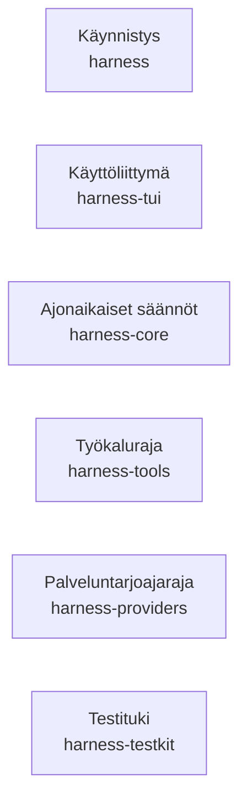
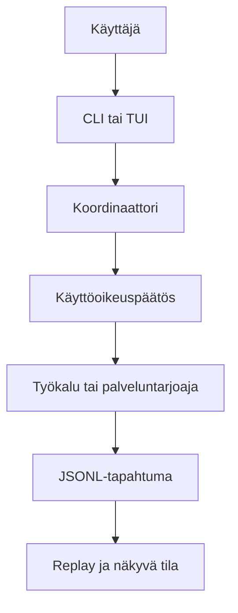
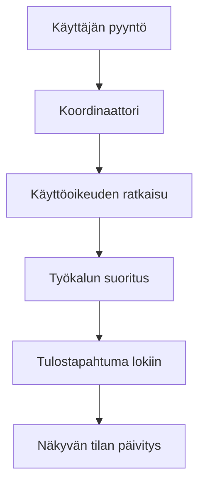
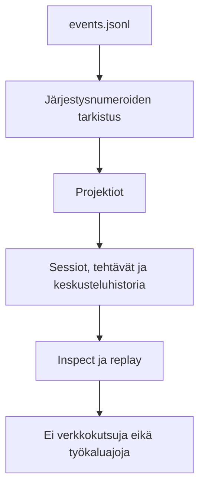
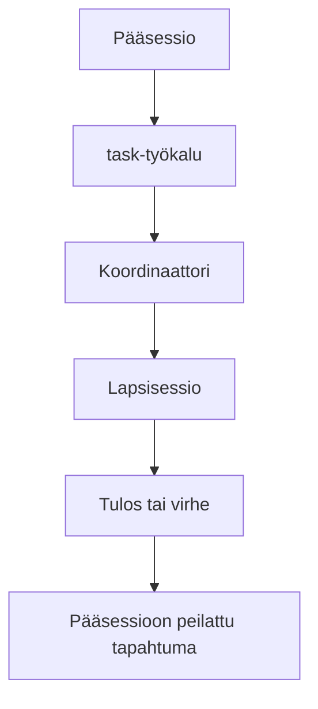
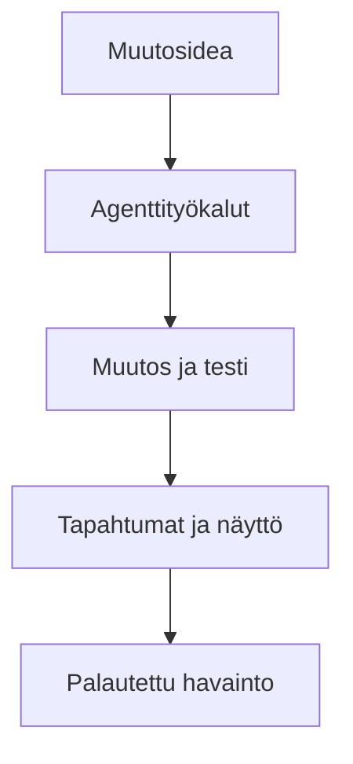

# Arkkitehtuuri ja itseään rakentava palaute

Kun projekti kasvoi, tärkeimmäksi arkkitehtuuriratkaisuksi nousi vastuiden pitäminen selkeinä. Käyttöliittymä saa näyttää ja välittää pyyntöjä, mutta se ei saa päättää ajon totuudesta. Työkalut saavat suorittaa rajattuja toimintoja, mutta eivät ohittaa käyttöoikeuksia. Tapahtumaloki puolestaan säilyttää sen, mitä todella tapahtui.

## Rust-työtilan rakenne

Koodi on jaettu kuuteen crateen. Jaon tarkoitus ei ole vain siisti hakemistorakenne, vaan muutosten vaikutusalueen rajaaminen. Esimerkiksi TUI voi muuttua ilman, että tapahtumamallin perussäännöt siirtyvät käyttöliittymäkerrokseen. Kaavio kokoaa vastuualueet lukujärjestykseen. Se ei kuvaa cratejen välisiä riippuvuuksia. Kaavion alla oleva taulukko kertoo kunkin craten varsinaisen vastuun.

| Crate | Vastuu ja tärkein oppi |
| --- | --- |
| `harness` | Omistaa komentorivin, sovelluksen käynnistyksen ja muiden cratejen kokoamisen. Käynnistyskerroksen kannattaa pysyä ohuena, jotta ajonaikaiset säännöt eivät hajaannu siihen. |
| `harness-core` | Omistaa koordinaation, tapahtumat, käyttöoikeudet, replayn ja elinkaaren. Yhdellä asialla pitää olla yksi selkeä päätöksentekijä. |
| `harness-providers` | Rajaa palveluntarjoajien suoratoiston ja redaktoidun metatiedon. Ulkoisen rajapinnan yksityiskohdat eivät saa vuotaa koko järjestelmään. |
| `harness-tools` | Omistaa työkalujen skeemat, polkuturvan, komentotulkin ja integraatiot. Työkalun nimi, syöte ja käyttöoikeus muodostavat yhden sopimuksen. |
| `harness-tui` | Omistaa näkymät, dialogit ja näppäimistökäytön. TUI on tilakone, ei vain tekstin piirtämistä. |
| `harness-testkit` | Tarjoaa deterministiset testikaksoisolennot, simulaatiot ja pääteajojen apurit. Testinäyttö tarvitsee toistettavan ympäristön. |

## Koordinaattori ajon keskuksena

Koordinaattori käsittelee komennot sarjassa. Se päättää tehtävien ajoituksesta, käyttöoikeuksista, tapahtumien lisäämisestä, kompaktioinnista ja elinkaaren muutoksista. Näin usea asynkroninen toiminto ei pääse kirjoittamaan keskenään ristiriitaista tilaa.

Yhden työkalukutsun aikana tapahtuu enemmän kuin käyttöliittymästä näkyy. Ensin tarkistetaan oikeus, sitten työkalu suoritetaan ja vasta lopuksi tulos kirjataan tapahtumaksi. Jos käyttäjän päätös tarvitaan, ajo jää odottamaan juuri siinä kohdassa.

## Tapahtumaloki ja replay

JSONL-loki on järjestelmän pysyvä muisti. Replay lukee tapahtumat järjestysnumeroiden mukaisesti ja johtaa niistä sessiot, tehtävät, keskusteluhistorian ja muut näkymät. Se ei käynnistä palveluntarjoajaa, työkaluja tai tapahtumakoukkuja uudelleen. Tämä raja tekee vanhan ajon tutkimisesta turvallista.

## Pää- ja alisessiot

Alisessio ei ole irrallinen prosessi, vaan osa samaa tapahtumaketjua. Koordinaattori luo lapsisession, rajaa sen kontekstin ja oikeudet sekä peilaa olennaiset tapahtumat takaisin pääsessioon. Jos peruutettu tehtävä valmistuu myöhässä, tulos kirjataan myöhäiseksi eikä sitä enää päästetä muuttamaan työtilaa.

## Järjestelmä oman kehityksen tukena

Projektin kiinnostavin vaihe alkoi, kun järjestelmästä tuli riittävän toimiva oman koodinsa tutkimiseen ja muuttamiseen. Tällöin kehitystyö alkoi ruokkia itseään. Työkalut nopeuttivat seuraavaa muutosta, mutta jokainen uusi kyky vaati samalla tarkemmat käyttöoikeudet ja paremman testinäytön.

Olisin hyötynyt yhdenmukaisesta testikuitista jo projektin alussa. Silloin jokainen merkittävä muutos olisi saanut heti omistajan, testin, tulospolun ja selkeän rajauksen.
