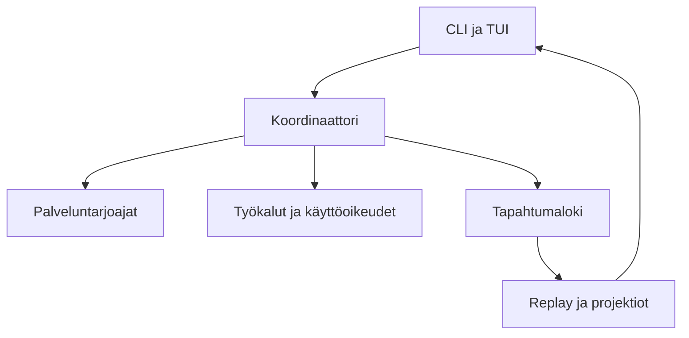

# Agenttiharnessin kehittämisen oppimispäiväkirja

**Opiskelija: Eemeli Kuittinen** 
**KAMK:n kurssiprojekti** 
**Ajanjakso 1.3.2026 - 31.7.2026**

Rakensin ensimmäisessä Rust-projektissani tapahtumalähteisen agenttiharnessin. Minulla oli jo paljon kokemusta agenttijärjestelmien käyttämisestä, mutta tällä kertaa jouduin katsomaan konepellin alle ja rakentamaan itse ajonaikaisen ytimen. Se tarkoitti muun muassa tehtävien ajoitusta, käyttöoikeuksia, työkalujen suoritusta, tapahtumalokia, palveluntarjoajia ja käyttöliittymää.

Clockify-seurantaan kertyi yli 300 tuntia jo ennen kesäkuun alkua. Kesän työstä en enää pitänyt tuntikirjanpitoa, joten projektin todellinen työmäärä on tätä suurempi. Laajuus kasvoi etenkin siksi, että kielimallit pystyivät tekemään rinnakkaista työtä pitkiä aikoja ja valmis järjestelmä alkoi vähitellen auttaa myös oman jatkokehityksensä tekemisessä.

## Kokonaiskuva

| Kysymys | Vastaus |
| --- | --- |
| Mitä syntyi | Rust-työtila, jossa koordinaattori, tapahtumaloki, käyttöoikeudet, työkalut, palveluntarjoajaraja ja TUI toimivat yhtenä järjestelmänä |
| Miten toimintaa voi seurata | JSONL-tapahtumista, replaysta, testeistä, simulaatioista ja ajonaikaisista todisteista |
| Mitä opin eniten | Selkeiden vastuurajojen, deterministisen testauksen ja ylläpidettävän Rust-rakenteen merkityksen |
| Mitä jatkan palautuksen jälkeen | TUI:n viimeistelyä, käyttämättömien Plan Mode -jäänteiden poistamista ja siirtymistä yhteen Build-tilaan |
| Mitä jäi myöhemmäksi | Paikallismallien laajempi live-testaus, osa alustakohtaisesta eristyksestä ja erillinen graafinen replay-näkymä |

## Lukupolku

1. **[Viikkomerkinnät](weeks/W09.md)** kulkevat projektin läpi viikosta W09 viikkoon W31.
2. **[Työskentelytapa ja tekoälyn käyttö](menetelma-ja-tekoaly.md)** kuvaa omaa rooliani mallien tuottaman työn keskellä.
3. **[Suunnitelma ja toteuma](suunnitelma-ja-toteuma.md)** näyttää, mihin alkuperäisistä tavoitteista pääsin ja mitä rajasin pois.
4. **[Arkkitehtuuri](arkkitehtuuri-ja-palaute.md)** avaa järjestelmän rakenteen koodin näkökulmasta.
5. **[Tulokset ja vaatimukset](tulokset-ja-vaatimukset.md)** kokoaa projektin hyödyt, rajat ja testinäytön.
