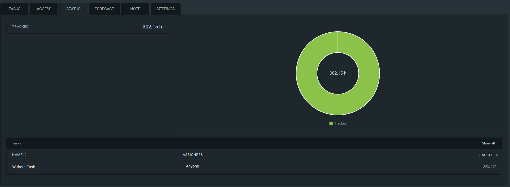
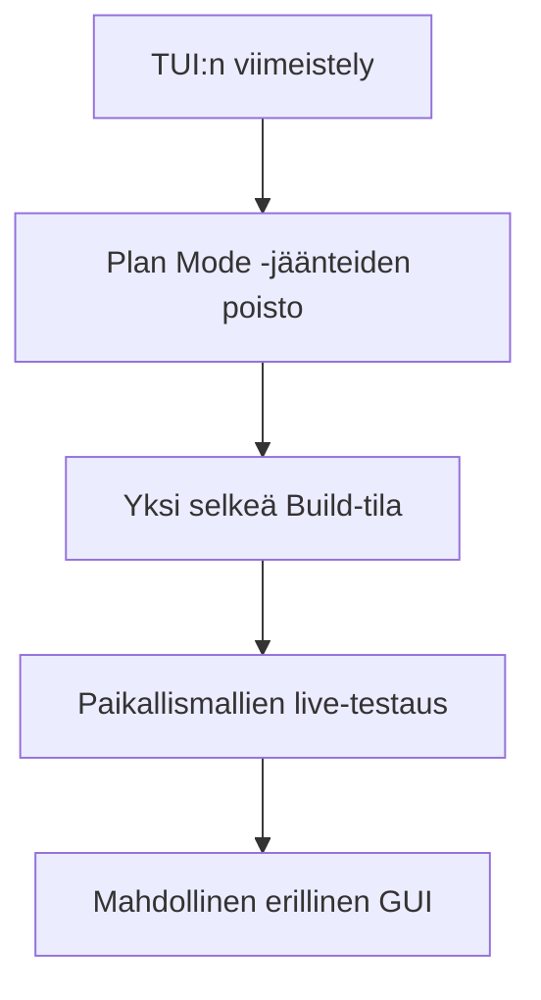

# Konkreettinen itsearviointi

## Mitkä tunnelmat projektista jäivät

Olen lopputulokseen tyytyväinen. Ensimmäiseksi Rust-projektiksi kokonaisuus kasvoi paljon suuremmaksi kuin alussa odotin, mutta sen tärkeimmät osat toimivat yhdessä. Erityisen palkitsevaa oli se vaihe, jossa järjestelmästä tuli riittävän valmis auttamaan oman jatkokehityksensä tekemisessä. Silloin projekti muuttui harjoituksesta työkaluksi, jota haluan käyttää ja kehittää myös palautuksen jälkeen.

Samalla projekti jäi aidosti kesken. Elämän muut kiireet söivät loppuvaiheesta aikaa, ja laaja ominaisuusjoukko teki viimeistelystä hitaampaa kuin arvioin. En silti pidä tätä epäonnistumisena. Toimiva ydin osoittaa, että ratkaisu on käyttökelpoinen, ja keskeneräiset osat ovat nyt selkeitä jatkokehityskohteita.

## Mitä opin

Suurin oppini liittyy vastuisiin. Monimutkainen järjestelmä ei pysy hallinnassa pelkillä hyvillä funktioilla. Jokaiselle päätökselle tarvitaan omistava kerros, jokaiselle tärkeälle tapahtumalle pysyvä jälki ja jokaiselle valmiusväitteelle testi, joka osoittaa käyttäjälle näkyvän lopputuloksen.

Opin Rustin omistusmallia, tyyppijärjestelmää ja virheenkäsittelyä käytännössä paljon enemmän kuin pienissä harjoituksissa olisi ollut mahdollista. Samalla opin, mitä harness engineering tarkoittaa käytännössä. Aiempi kokemukseni agenttijärjestelmien käyttämisestä auttoi arvioimaan käyttökokemusta, mutta vasta tämän projektin aikana jouduin ratkaisemaan itse koordinoinnin, käyttöoikeuksien, tapahtumalokin, replayn, työkalujen ja palveluntarjoajarajojen kaltaiset ongelmat.

Kielimallit tuottivat arvioni mukaan noin 99 prosenttia koodista. Oma työni painottui tavoitteiden rajaamiseen, muutosten hyväksymiseen, testitulosten tarkastamiseen ja sen päättämiseen, milloin ratkaisu oli oikeasti riittävän hyvä. Projektin aikana julkaistut uudet mallit nopeuttivat työskentelyä selvästi. Opin samalla, ettei nopea koodintuotanto poista tarkastusvastuuta. Se kasvattaa sitä.

| Arviointikohde | Oma näyttöni ja tärkein oppi |
| --- | --- |
| Tekninen syvyys | Koordinaattori, tapahtumat, käyttöoikeudet, replay ja työkalut muodostavat yhtenäisen ytimen. Järjestelmän keskeiset säännöt ovat koodissa ja testeissä, eivät vain dokumentaatiossa. |
| Oman oppimisen arviointi | Pystyn perustelemaan tärkeimmät valinnat ja myös sen, miksi jokin vaihtoehto jäi toteuttamatta. Opin tunnistamaan, milloin rajaus on teknistä toteutusta tärkeämpi päätös. |
| Tekoälyn käyttö | Mallien osuus koodista oli erittäin suuri, mutta vastuu rajauksesta, hyväksymisestä ja testauksesta jäi minulle. Käytin malleja myös vaihtoehtojen, testien ja dokumentaation tuottamiseen. |
| Laatu ja testinäyttö | Testit, simulaatiot, replay ja CI olivat osa arkkitehtuuria alusta asti. Opin, että hyväksyntänäytön pitää olla sidottu samaan revisioon kuin väite, jonka se todistaa. |
| Käytettävyys | CLI ja TUI tekevät järjestelmän tilan näkyväksi. Toimiva käyttöliittymä osoitti nopeasti, mitkä ajonaikaiset tilat ja tapahtumat olivat vielä epäselviä. |

## Missä haluaisin vielä parantaa toimintaani

Haluan parantaa erityisesti työn rajaamista ja valmiuskriteerien määrittelyä. LLM-ajojen nopeus teki uusien ominaisuuksien aloittamisesta helppoa, mutta rinnakkaisten muutosten tarkastaminen keräsi velkaa. Jatkossa pilkon muutokset pienemmiksi ja kirjoitan hyväksymisehdot ennen toteutusta.

Haluan myös pitää dokumentaation lähempänä muuttuvaa koodia. Projektin loppupuolella lähdekoodi ja testit kuvasivat nykytilaa dokumentaatiota tarkemmin. Lisäksi jatkan tuntiseurantaa koko projektin ajan. Kesän kirjaamattomat tunnit tekevät toteutuneesta kokonaistyömäärästä väistämättä arvion.

## Mitä tekisin toisin

1. Aloittaisin testinäytön rekisterin ensimmäisellä viikolla. Jokaiselle tavoitteelle tulisi heti omistaja, hyväksymisehto, testi ja tulospolku.
2. Rajaisin rinnakkaisten kielimalliajojen tehtävät pienemmiksi. Suuri ominaisuusjoukko teki saman revision hyväksymisestä tarpeettoman vaikeaa.
3. Päättäisin siirretyistä ominaisuuksista näkyvästi jo kesken projektin. Silloin niiden puuttuminen ei näyttäisi vahingossa keskeneräiseltä toteutukselta.
4. Jatkaisin Clockify-seurantaa myös kesällä. Nyt tiedän tarkan kirjatun määrän ennen kesäkuuta, mutta koko projektin tuntimäärä jäi avoimeksi.
5. Rauhoittaisin viimeiset viikot viimeistelylle. Uusien ominaisuuksien sijasta käyttäisin ajan TUI:n, dokumentaation ja yhden selkeän hyväksyntärevision hiomiseen.

## Minkä arvosanan antaisin itselleni

Antaisin itselleni arvosanaksi **4/5**.

Arvosanaa puoltavat yli 300 kirjattua työtuntia, teknisesti vaativa tekoälyaihe, toimiva ja itselleni hyödyllinen lopputulos sekä laaja testaus- ja jäljitettävyysrakenne. Ensimmäiseksi Rust-projektiksi kokonaisuus on kunnianhimoinen, ja koodin rakenne mahdollistaa ylläpidon ja jatkokehityksen.

En antaisi itselleni arvosanaa viisi, koska kaikkia alkuperäisiä tavoitteita ei saatu valmiiksi. Paikallismallien laajempi live-testaus, osa alustakohtaisesta eristyksestä ja erillinen graafinen replay-näkymä jäivät myöhemmäksi. Myös Plan Mode -jäänteet pitää poistaa ennen kuin työnkulku on niin selkeä kuin haluan. Nelonen kuvaa mielestäni vahvaa ja toimivaa projektia, jossa on samalla rehellisesti tunnistettuja puutteita.

## Evidenssi henkilökohtaisesta tuntimäärästä

Clockifyyn on kirjattu projektityötä yhteensä **302,15 tuntia**. Kuvan määrä on kertynyt ennen kesäkuuta. Kesän aikana en enää jatkanut tuntikirjanpitoa, joten projektin todellinen henkilökohtainen työmäärä on tätä suurempi. En arvioi puuttuvia kesätunteja jälkikäteen, jotta evidenssi ja oma arvio pysyvät erillään.

*Kuva 1. Clockify-seurannan henkilökohtainen tuntimäärä 302,15 tuntia ennen kesäkuuta.*

[Avaa Clockify-kuva täysikokoisena](assets/clockify-302-15h.png)

## Seuraava konkreettinen askel

Seuraavaksi keskityn TUI:n viilaamiseen ja yksinkertaistan järjestelmän pelkkään Build-tilaan. Plan Mode ei ole tällä hetkellä käytettävissä, joten sen viimeistelyn sijasta poistan koodiin jääneet Plan Mode -tyypit, komennot ja käyttöliittymäpolut. Tämän jälkeen voin jatkaa paikallismallien live-testausta ja arvioida myöhemmin erillisen graafisen näkymän tarvetta.

