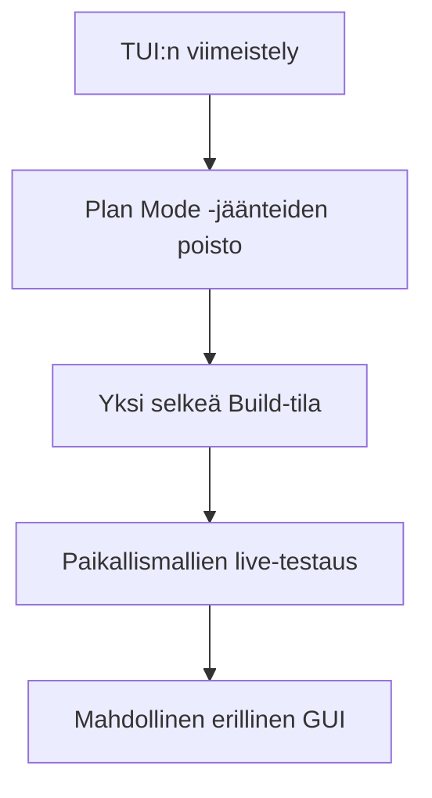

# Konkreettinen itsearviointi

Olen lopputulokseen tyytyväinen. Ensimmäiseksi Rust-projektiksi kokonaisuus kasvoi paljon suuremmaksi kuin alussa odotin, mutta sen tärkeimmät osat toimivat yhdessä. Samalla projekti jäi aidosti kesken. Tämä ei tarkoita, että työ olisi epäonnistunut, vaan että toimiva ydin avasi enemmän jatkokehityssuuntia kuin palautukseen oli mahdollista mahduttaa.

Suurin oppini liittyy vastuisiin. Monimutkainen järjestelmä ei pysy hallinnassa pelkillä hyvillä funktioilla. Jokaiselle päätökselle tarvitaan omistava kerros, jokaiselle tärkeälle tapahtumalle pysyvä jälki ja jokaiselle valmiusväitteelle testi, joka osoittaa käyttäjälle näkyvän lopputuloksen.

| Arviointikohde | Oma näyttöni ja parannus |
| --- | --- |
| Tekninen syvyys | Koordinaattori, tapahtumat, käyttöoikeudet, replay ja työkalut muodostavat yhtenäisen ytimen. Vahvuutena on se, että järjestelmän keskeiset säännöt ovat koodissa ja testeissä, eivät vain dokumentaatiossa. |
| Oman oppimisen arviointi | Pystyn perustelemaan tärkeimmät valinnat ja myös sen, miksi jokin toinen ratkaisu jäi käyttämättä. Seuraavaksi haluan kirjata hyväksymisehdot jo ennen toteutusta. |
| Tekoälyn käyttö | Mallien osuus koodista oli erittäin suuri, mutta vastuu rajauksesta, hyväksymisestä ja testauksesta jäi minulle. Jatkossa haluan pienentää rinnakkaisten muutosten kokoa, jotta tarkastusvelka ei kasva yhtä nopeasti. |
| Laatu ja testinäyttö | Testit, simulaatiot, replay ja CI olivat osa arkkitehtuuria alusta asti. Parannettavaa jäi siinä, että kaikki hyväksyntänäyttö ei ollut aina samasta revisiosta. |
| Käytettävyys | CLI ja TUI tekevät järjestelmän tilan näkyväksi. Seuraava selkeä työ on TUI:n viimeistely ja työnkulun yksinkertaistaminen yhteen Build-tilaan. |

## Mitä tekisin toisin

1. Aloittaisin testinäytön rekisterin ensimmäisellä viikolla. Jokaiselle tavoitteelle tulisi heti omistaja, hyväksymisehto, testi ja tulospolku.
2. Rajaisin rinnakkaisten kielimalliajojen tehtävät pienemmiksi. Suuri ominaisuusjoukko teki saman revision hyväksymisestä tarpeettoman vaikeaa.
3. Päättäisin siirretyistä ominaisuuksista näkyvästi jo kesken projektin. Silloin niiden puuttuminen ei näyttäisi vahingossa keskeneräiseltä toteutukselta.
4. Jatkaisin Clockify-seurantaa myös kesällä. Nyt tiedän, että työtä kertyi yli 300 tuntia jo ennen kesäkuuta, mutta koko projektin tarkka määrä jäi avoimeksi.

## Seuraava konkreettinen askel

Seuraavaksi keskityn TUI:n viilaamiseen ja yksinkertaistan järjestelmän pelkkään Build-tilaan. Plan Mode ei ole tällä hetkellä käytettävissä, joten sen viimeistelyn sijasta poistan koodiin jääneet Plan Mode -tyypit, komennot ja käyttöliittymäpolut. Tämän jälkeen voin jatkaa paikallismallien live-testausta ja arvioida myöhemmin erillisen graafisen näkymän tarvetta.

