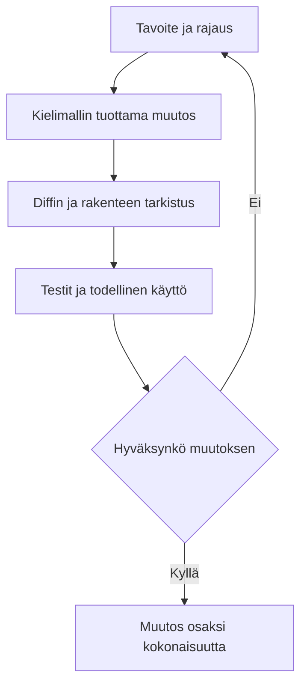

# Työskentelytapa ja tekoälyn käyttö

## Työn seuranta

Työskentely muuttui projektin mukana. Alussa keskityin Rustin perusteisiin ja pienten osien yhteen liittämiseen. Loppua kohti suurin osa ajasta kului siihen, että tarkistin rinnakkaisten muutosten yhteensopivuutta ja varmistin, ettei yhden kerroksen korjaus rikkonut toista.

| Seurantatapa | Käyttö projektissa |
| --- | --- |
| Git-commitit | Niistä näen, milloin ratkaisu muuttui ja mihin tiedostoihin muutos osui. |
| Lähdekoodi | Koodi kertoo parhaiten, miten vastuut lopulta jakautuivat ja missä rajat edelleen vuotavat. |
| Testit ja CI | Testit pakottavat muuttamaan oletuksen tarkistettavaksi käyttäytymiseksi. |
| Clockify | Seurantaan kertyi yli 300 tuntia ennen kesäkuuta. Kesältä tuntikirjanpitoa ei enää ole. |

## Tekoälyn käyttö ja oma vastuu

Arvioni mukaan kielimallit tuottivat noin 99 prosenttia koodista. Luku ei ole mittaustulos, vaan oma arvioni työnjaosta. Oma työni painottui tavoitteiden asettamiseen, ratkaisujen valintaan, ajoketjujen ohjaamiseen, muutosten tarkastamiseen ja sen päättämiseen, milloin tulokseen voi luottaa.

Tekoäly madalsi kynnystä tarttua Rustiin ja antoi mahdollisuuden kokeilla nopeasti useita toteutustapoja. Projektin aikana julkaistut uudet mallit paransivat työn laatua selvästi. Pitkiä ajoja pyöri lähes ympäri vuorokauden, joten koodia syntyi paljon nopeammin kuin ehdin itse kirjoittaa tai edes lukea rivi riviltä. Tästä syntyi projektin suurin jännite. Tuottavuus kasvoi, mutta samalla kasvoi vastuu siitä, että rajapinnat, käyttöoikeudet, tapahtumat ja testit todella sopivat yhteen.

| Hyöty | Riski ja vastatoimi |
| --- | --- |
| Nopeampi vaihtoehtojen kokeilu | Muutos saattoi kasvaa liian suureksi tai osua väärään kerrokseen. Rajasin tehtävän omistajan ja tarkistin arkkitehtuurirajan ennen hyväksymistä. |
| Testien ja dokumentaation tuottaminen | Malli saattoi kirjoittaa uskottavan mutta todentamattoman väitteen. Hyväksyin väitteen vasta, kun sille löytyi tuki koodista tai testistä. |
| Toistuvan työn automatisointi | Sama virhe saattoi monistua useaan tiedostoon. Tarkistin diffit ja ajoin muutoksen omistavan osan testit. |

