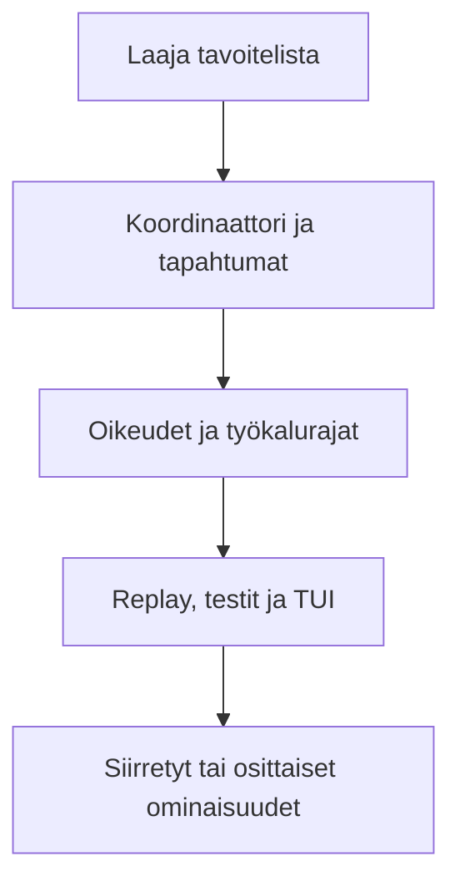

# Alkuperäinen suunnitelma ja toteuma

Alkuperäinen suunnitelma oli kunnianhimoinen. Halusin samaan projektiin pää- ja alisessiot, turvalliset työkalut, täydellisen tapahtumahistorian, TUI:n, useita tunnistautumistapoja, paikalliset mallit ja mahdollisesti vielä erillisen graafisen replay-näkymän. Työn edetessä päätin käyttää eniten aikaa ajonaikaiseen ytimeen, käyttöoikeuksiin ja replayhin, koska niiden päälle kaikki muu rakentuu.

| Tavoite | Toteuma ja rajaus |
| --- | --- |
| Pää- ja alisessiot | Saavutettu pääosin. Koordinaattori, periytyminen, child-session-tapahtumat ja task-työkalut muodostavat ytimen. |
| Rinnakkaisuus, keskeytys, uudelleenyritys ja aikakatkaisu | Saavutettu pääosin. Elinkaari on tyypitetty ja uudelleenyritysten metatieto säilyy näkyvänä. |
| Konteksti ja agenttikohtaiset oikeudet | Saavutettu. Kehotteet, ladatut taidot, työkalujen suodatus ja käyttöoikeuskäytäntö ovat osa ajonaikaista virtaa. |
| Luku, haku, muokkaus ja komentotulkki | Saavutettu. Yhteinen työkalurekisteri ja komentotulkin turvarajat kattavat keskeisen työkalupinnan. |
| Työtilan eristys ja sallittujen komentojen raja | Linux-painotteisesti saavutettu. Polkuluvat ja oletuksena estävä eristys toimivat, mutta alustakohtaisia eroja jäi. |
| Tapahtumaskeema, JSONL ja replay | Saavutettu. `EventEnvelopeV1`, tapahtumavarasto, projektiot, keskusteluhistoria ja sessiotyökalut muodostavat kokonaisuuden. |
| Live TUI, sessiopuu, diff ja replay | Pääosin saavutettu. Keskeiset näkymät toimivat, mutta TUI tarvitsee vielä viimeistelyä ja työnkulun yksinkertaistamista. |
| OAuth, BYOK ja paikalliset mallit | Osittain saavutettu. Tunnistautuminen ja yhteensopiva palveluntarjoajaraja ovat mukana, mutta paikallismallien laaja live-testaus puuttuu. |
| Erillinen graafinen replay-näkymä | Siirretty. TUI ja ajonaikainen ydin asetettiin etusijalle. |
| Yhden revision täydellinen hyväksyntä | Osittain saavutettu. Laajoja testiajoja on tehty, mutta kaikki hyväksyntänäyttö ei ole samasta lukitusta revisiosta. |

## Priorisointiketju

Priorisointi osoittautui oikeaksi. Näyttävä käyttöliittymä tai uusi integraatio ei auta paljon, jos koordinaattori voi kadottaa tapahtuman tai työkalu voi ohittaa käyttöoikeuden. Seuraavassa kehitysvaiheessa kirjaan jokaiselle tavoitteelle mitattavan hyväksymisehdon jo ennen toteutusta.
