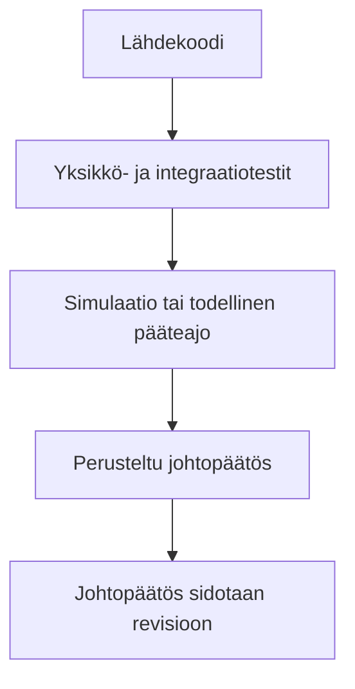
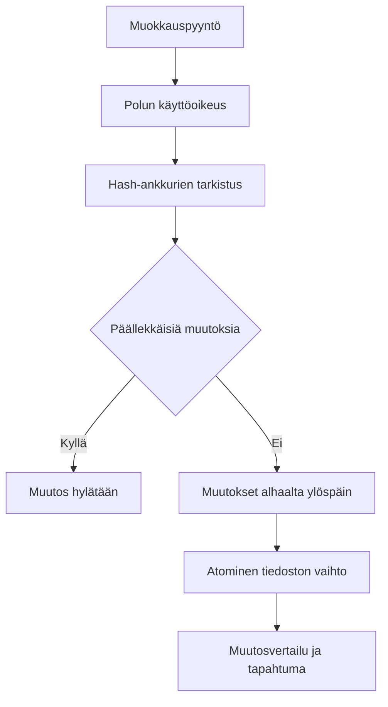

# Tulokset ja vaatimusten jäljitettävyys

Lopputulos toimii ja on mielestäni hyvä, mutta en pidä sitä vielä valmiina tuotteena. Laajassa testiajossa 26.7.2026 läpäisi 5 242 testiä ja 21 testiä ohitettiin. Sen jälkeen koodi muuttui vielä paljon, joten tulos kertoo kyseisestä revisiosta eikä automaattisesti projektin viimeisestä tilasta. Tämä oli tärkeä oppi myös oman työn arvioinnissa. Vihreä testiraportti vanhasta versiosta ei riitä uuden version todisteeksi.

| Vaatimus | Toteuma, näyttö ja raja |
| --- | --- |
| Tapahtumapohjainen jäljitysketju | `EventEnvelopeV1`, tapahtumavarasto ja JSONL mahdollistavat tapahtumista johdetun replayn. Tapahtumaloki ei kuitenkaan yksin todista jokaista käyttöliittymäpolkua. |
| Oikeus ennen työkalua | Käyttöoikeuskäytäntö tarkistetaan ennen suoritusta, eikä alisessio saa ohittaa perittyjä rajoja. Eristyksessä on silti alustakohtaisia eroja. |
| Deterministinen testaus | Testikaksoisolennot, tallennetut palveluntarjoajavirrat ja simulaatio vähentävät verkkoriippuvuutta. Kaikki live-polut eivät kuulu oletus-CI:hin. |
| Käyttäjäpinta | CLI, Ratatui TUI, sessiopuu ja replay tekevät keskeisen työskentelypolun näkyväksi. Seuraava työvaihe on TUI:n viimeistely ja tarpeettoman Plan Mode -rakenteen poistaminen. |
| Turvallinen muokkaus | Hashline-ankkurit, päällekkäisyyksien hylkäys ja atominen kirjoitus sitovat muutoksen tarkistettuun sisältöön. Käyttäjän täytyy silti arvioida, onko muutos tarkoituksenmukainen. |

## Näytön tasot

Käytännössä tämä tarkoittaa, että testituloksen yhteydessä täytyy tietää, millä koodiversiolla se syntyi. Jos koodi muuttuu, myös hyväksyntä täytyy ajaa uudelleen.

## Hashline-muokkauksen turvaketju

Tekstimuokkauksessa pelkkä rivinumero ei riitä, koska toinen muutos voi siirtää sisältöä. Hashline-muokkaus tarkistaa sekä rivin että sen sisältöön sidotun ankkurin. Ristiriitaiset muutokset hylätään ennen kirjoitusta, ja hyväksytty tulos vaihdetaan tiedostoon atomisesti.

## Hyöty

Projektin suurin hyöty on se, että monivaiheinen agenttiajo ei jää mustaksi laatikoksi. Voin tarkastella tapahtumista, mitä agentti teki, millä oikeudella työkalu suoritettiin ja mistä näkyvä tila muodostui. Samalla projektista tuli oikea työväline. Sen avulla pystyy jo tutkimaan ja muuttamaan omaa koodia. Tämä palautesilmukka on yksi tärkeimmistä syistä, joiden vuoksi aion jatkaa kehitystä palautuksen jälkeen.
