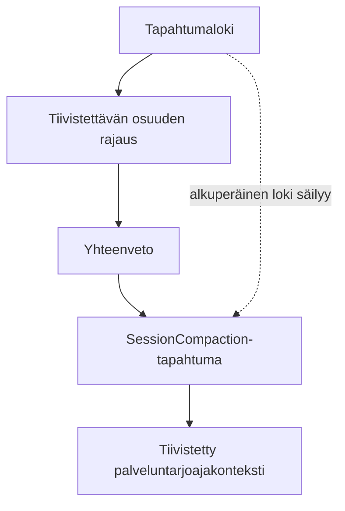

# W29: `SessionCompaction`, koko leveyden komentotila ja testinäyttö

**Päivät:** 13.7.2026 - 19.7.2026

## Järjestelmä alkaa testata itseään

Toteutin `SessionCompaction`-tapahtumaa, koko leveyden komentotilaa ja järjestelmän käyttöä oman projektinsa testaamiseen. Samalla rakensin selkeämmän tavan yhdistää testiajo, revisio ja syntynyt artefakti toisiinsa.

## Näyttö on oma ominaisuutensa

Testinäyttö pitää suunnitella ominaisuutena. Testin nimi, raportti ja suoritetun revision tunniste kertovat yhdessä paljon enemmän kuin irrallinen läpäissyt merkintä. Oman järjestelmän käyttäminen sen kehitykseen toi tämän hyvin näkyviin.

Irralliset lokirivit olisivat kertoneet, että jotakin ajettiin. Rakenteisen näytön avulla voin kysyä, mikä skenaario ajettiin, missä ympäristössä ja mihin tulos tallentui.

## Seuraava testikuitti

Jokainen omalla järjestelmällä tehty testiajo saa koneellisesti kirjoitettavan kuitin. Siihen kuuluvat revisio, skenaario, komento, artefaktipolku ja arkaluonteisen tiedon tarkistus.

Kompaktiossa alkuperäinen tapahtumaloki säilyy, vaikka palveluntarjoajalle annettava konteksti tiivistyy.

## Kompaktion ja testauksen jäljet

- Git-commitit [`90b65479`](https://gitlab.dclabra.fi/urbanbreach/agent-harness/-/commit/90b65479), [`00ee7e3e`](https://gitlab.dclabra.fi/urbanbreach/agent-harness/-/commit/00ee7e3e), [`27f4bf55`](https://gitlab.dclabra.fi/urbanbreach/agent-harness/-/commit/27f4bf55) ja [`5447b93e`](https://gitlab.dclabra.fi/urbanbreach/agent-harness/-/commit/5447b93e)
- `SessionCompaction`, komentotila, oman järjestelmän testiajo ja näyttöartefaktit
